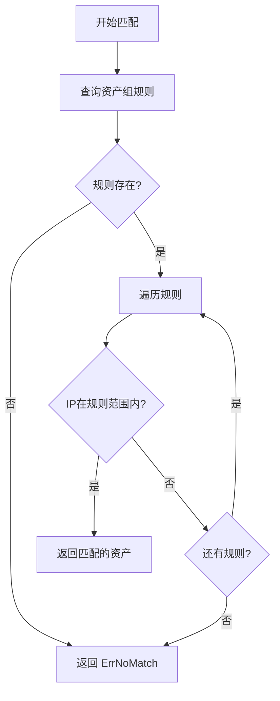
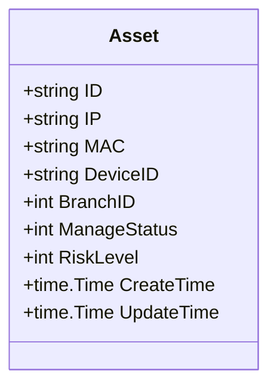
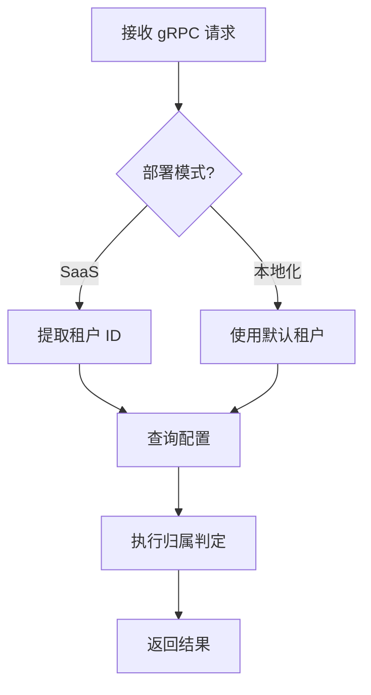

# 附录A：基础原则示例（原则 0-5）

**上级文档**：[01-documentation-standards.md](./01-documentation-standards.md)

本附录提供原则 0-5（基础原则）的详细示例、对比表格和模板。

**完整附录索引**：
- **本文档** - 附录A：原则 0-5（职责、图表、同架、术语、数据、真实）
- [01B-principles-6-11-examples.md](./01B-principles-6-11-examples.md) - 附录B：原则 6-11（实质、时效、关联、体系、溯源、决策）
- [01C-writing-standards-details.md](./01C-writing-standards-details.md) - 附录C：书写标准详细说明

---

## 原则 0：单一职责，职责清晰

### 详细说明

每个文档必须职责唯一，能用一句话准确概括。如果无法用一句话概括，说明文档职责不清晰，需要拆分。

### 一句话测试法

| 文档标题 | 一句话概括 | 是否通过 | 处理方案 |
|---------|-----------|---------|---------|
| `01-architecture-overview.md` | 描述系统整体架构 | ✅ 通过 | 保持 |
| `02-cache-and-query-optimization.md` | 描述缓存策略和查询优化 | ❌ 不通过 | 拆分为 `02-cache-strategy.md` + `03-query-optimization.md` |
| `03-api-design-and-error-handling.md` | 描述 API 设计和错误处理 | ❌ 不通过 | 拆分为 `03-api-design.md` + `04-error-handling.md` |

### 拆分示例：从混合文档到单一职责

**❌ 错误示例**（职责混乱）：

```
# 缓存策略与数据库优化

## 1. 缓存架构
## 2. 缓存更新策略
## 3. MongoDB 索引优化
## 4. 查询性能调优
## 5. 数据一致性保证
```

**✅ 正确示例**（拆分后）：

文档 1：`02-cache-strategy.md`
```
# 缓存策略设计

## 1. 缓存架构
## 2. 缓存更新策略
## 3. 缓存一致性保证
```

文档 2：`03-database-optimization.md`
```
# MongoDB 性能优化

## 1. 索引设计
## 2. 查询优化
## 3. 读写性能调优
```

### 边界清晰示例

**技术分析文档边界**：

| 应该包含 | 不应该包含 | 原因 |
|---------|-----------|------|
| ✅ 系统架构设计 | ❌ 项目排期计划 | 排期属于项目管理，不属于技术设计 |
| ✅ 算法实现方案 | ❌ 测试用例列表 | 测试用例应在测试计划文档中 |
| ✅ 数据库Schema设计 | ❌ 数据迁移步骤 | 迁移步骤应在实施计划中 |
| ✅ API 接口定义 | ❌ 前端调用示例 | 调用示例应在集成文档中 |

---

## 原则 1：图表优先，代码从简

### 详细说明

代码块不超过 **5 行**。超过 5 行的代码必须用 Mermaid 图表替代。

### 代码行数限制对比

**❌ 错误示例**（代码块超过5行）：

```markdown
## 资产匹配算法

```go
func matchAsset(ip string, branchID int) (*Asset, error) {
    // 1. 查询资产组规则
    rules, err := getRulesByBranch(branchID)
    if err != nil {
        return nil, err
    }
    // 2. 遍历规则匹配
    for _, rule := range rules {
        if matchIPRange(ip, rule.IPRange) {
            return getAssetByRule(rule), nil
        }
    }
    // 3. 无匹配则返回nil
    return nil, ErrNoMatch
}
```
```

**✅ 正确示例**（用流程图替代）：

```markdown
## 资产匹配算法



**代码位置**：`internal/belong/match.go:123-145`
```

### Mermaid 图表类型选择

| 内容类型 | 推荐图表 | 示例 |
|---------|---------|------|
| 数据结构/类定义 | `classDiagram` | 资产模型、配置结构 |
| 算法流程/业务流程 | `flowchart` | 归属判定流程、查询流程 |
| 系统交互 | `sequenceDiagram` | gRPC 调用流程、事件处理流程 |
| 状态机 | `stateDiagram` | 资产审核状态转换 |
| 架构图 | `graph TD` 或 C4 | 系统架构、模块关系 |

### 数据结构示例

**❌ 错误示例**（Go struct 超过5行）：

```markdown
## 资产数据模型

```go
type Asset struct {
    ID           string    `bson:"_id"`
    IP           string    `bson:"ip"`
    MAC          string    `bson:"mac"`
    DeviceID     string    `bson:"device_id"`
    BranchID     int       `bson:"branch_id"`
    ManageStatus int       `bson:"manage_status"`
    RiskLevel    int       `bson:"risk_level"`
    CreateTime   time.Time `bson:"create_time"`
    UpdateTime   time.Time `bson:"update_time"`
}
```
```

**✅ 正确示例**（使用 classDiagram）：

```markdown
## 资产数据模型



**代码位置**：`internal/model/asset/model.go:23-33`
```

---

## 原则 2：同架设计，差异标注

### 详细说明

SaaS 和本地化使用同一套代码，通过配置文件或环境变量切换行为。文档中仅标注差异点，不做全量对比。

### 配置切换示例

**代码中的配置开关**：

```go
// 配置结构
type Config struct {
    DeployMode string `yaml:"deployMode"` // "saas" 或 "local"
}

// 根据部署模式切换行为
if config.DeployMode == "saas" {
    // SaaS 特有逻辑：多租户隔离
} else {
    // 本地化特有逻辑：单租户
}
```

**代码位置**：`internal/config/config.go:45-52`

### 文档中的差异标注

**❌ 错误示例**（全量对比）：

```markdown
## 资产归属判定流程

### SaaS 版本流程
1. 接收 gRPC 请求
2. 提取租户 ID
3. 查询租户配置
4. 执行归属判定
5. 返回结果

### 本地化版本流程
1. 接收 gRPC 请求
2. ~~提取租户 ID~~（无此步骤）
3. 查询全局配置
4. 执行归属判定
5. 返回结果
```

**✅ 正确示例**（仅标注差异）：

```markdown
## 资产归属判定流程



**环境差异**：
- **SaaS**：支持多租户，根据请求头中的 `tenant_id` 区分租户
- **本地化**：单租户，使用配置文件中的默认 `tenant_id`

**配置切换**：`config.yaml` 中 `deployMode: saas|local`
```

### 默认共同原则

**大多数功能是共同的**，文档中**无需重复说明**。

| 功能 | SaaS | 本地化 | 文档处理 |
|------|------|--------|---------|
| gRPC 接口定义 | ✅ 相同 | ✅ 相同 | 不标注 |
| 归属判定算法 | ✅ 相同 | ✅ 相同 | 不标注 |
| MongoDB Schema | ✅ 相同 | ✅ 相同 | 不标注 |
| 租户隔离 | ✅ 多租户 | ❌ 单租户 | **仅标注此差异** |
| Kafka 集群配置 | ☁️ 云服务 | 🏢 内网部署 | **仅标注此差异** |

---

## 原则 3：专业术语，避免口语

### 详细说明

使用行业标准术语，删除口语化表达和自问自答形式。

### 口语化表达对比

| 口语化表达 | 专业术语 |
|-----------|---------|
| "可能会出现问题" | "在高并发场景下存在竞态条件" |
| "大概需要100ms" | "P95延迟为95ms，P99延迟为120ms" |
| "用户说性能不好" | "根据生产环境监控，QPS峰值达到5000时CPU使用率超过80%" |
| "应该不会有问题" | "经过压力测试验证，系统在QPS 8000时稳定运行" |
| "差不多就行" | "满足性能要求：P99延迟 < 100ms" |

### 删除自问自答形式

**❌ 错误示例**（自问自答）：

```markdown
## 为什么选择 MongoDB？

因为 MongoDB 支持灵活的 Schema 设计，并且具有良好的水平扩展能力。

## 如何保证数据一致性？

通过在 MongoDB 中使用分布式锁，确保并发创建资产时不会重复。

## FAQ

**Q: 缓存更新失败怎么办？**
A: 系统会自动重试3次，如果仍然失败则记录错误日志。
```

**✅ 正确示例**（去掉问答形式）：

```markdown
## 数据库选型

选择 MongoDB 作为存储引擎，主要原因：
- 灵活的 Schema 设计，适应资产字段频繁变更
- 支持水平扩展，满足多租户场景的数据隔离需求

## 数据一致性保证

使用 MongoDB 分布式锁机制，在并发创建资产时防止重复：
- 锁粒度：`tenant_id + ip`
- 锁超时：30秒
- 重试策略：指数退避，最多重试3次

**代码位置**：`internal/model/asset/create.go:67-89`
```

### 专业术语使用

**性能指标术语**：

| 术语 | 含义 | 示例 |
|------|------|------|
| QPS (Queries Per Second) | 每秒查询数 | 系统 QPS 峰值为 8000 |
| P50/P95/P99 | 延迟百分位数 | P95 延迟为 85ms |
| CPU limit / Memory limit | 资源限制 | CPU limit 4 cores, Memory limit 8GB |
| Throughput | 吞吐量 | 系统吞吐量为 10000 req/s |
| IOPS (I/O Operations Per Second) | 磁盘 I/O 性能 | MongoDB IOPS 达到 5000 |

---

## 原则 4：数据驱动，有据可查

### 详细说明

所有设计决策基于实际数据，标注数据来源、采集时间、查询方法。

### 数据来源标注示例

**✅ 正确示例**：

```markdown
## 接口调用量分析

**数据来源**：生产环境 MongoDB 日志统计
**采集时间**：2025-01-10 至 2025-01-17（7天）
**数据范围**：全部租户

| 接口名称 | 日均调用量 | 占比 |
|---------|-----------|------|
| AssetQueryByIP | 1,250,000 | 89.3% |
| EndGetBelong | 85,000 | 6.1% |
| NetGetBelong | 42,000 | 3.0% |
| 其他接口 | 23,000 | 1.6% |

**数据获取方法**：
```js
db.idt_logs.aggregate([
  { $match: { timestamp: { $gte: ISODate("2025-01-10"), $lt: ISODate("2025-01-17") } } },
  { $group: { _id: "$interface", count: { $sum: 1 } } },
  { $sort: { count: -1 } }
])
```

**监控面板**：[Grafana Dashboard - go-idt接口统计](http://grafana.example.com/d/go-idt-rpc)
```

### 数据来源类型

| 数据来源 | 标注格式 | 示例 |
|---------|---------|------|
| MongoDB 查询 | 提供查询语句和结果 | 见上方示例 |
| Grafana 监控 | 提供面板链接和截图 | `[监控面板](url)` + 截图 |
| Confluence 文档 | 提供文档链接 | `[需求文档](confluence://xxx)` |
| 生产环境日志 | 提供日志查询命令 | `grep "ERROR" /var/log/go-idt/*.log` |
| 代码静态分析 | 提供代码位置 | `internal/belong/match.go:123-145` |

---

## 原则 5：真实可靠，基于事实

### 详细说明

文档内容必须基于实际代码和数据，禁止猜测、臆想、假设。

### 信息确定性标注

**使用状态标签明确信息来源**：

| 标签 | 含义 | 使用场景 |
|------|------|---------|
| ✅ 基于代码 | 信息来自实际代码验证 | 算法逻辑、数据结构定义 |
| ✅ 基于数据 | 信息来自生产环境数据 | 性能指标、调用量统计 |
| ✅ 基于分析 | 信息来自代码逻辑推导 | 复杂度分析、性能预估 |
| ❓ 信息缺失 | 缺少代码或数据支撑 | 需要补充验证 |
| ⚠️ 待验证 | 推测性结论，需要实验验证 | 性能优化预期效果 |

**示例**：

```markdown
## 归属判定性能分析

### 当前性能指标

- ✅ **基于代码**：归属判定算法时间复杂度为 O(n)，n 为资产组规则数量
  - **代码位置**：`internal/belong/match.go:123-156`
- ✅ **基于数据**：P95 延迟为 85ms，P99 延迟为 120ms
  - **数据来源**：Grafana 监控（2025-01-10 至 2025-01-17）
- ✅ **基于分析**：当规则数量 > 1000 时，延迟将显著增加
  - **推导依据**：O(n) 复杂度，n=1000时遍历成本为当前的10倍

### 性能优化方向

- ⚠️ **待验证**：使用 Trie 树优化 IP 范围匹配，预期 P95 延迟降低至 40ms
  - **验证方法**：在测试环境实现原型并压测
```

### 禁用词汇清单

**必须删除的不确定表达**：

| 禁用词 | 替代表达 |
|--------|---------|
| "可能" | "在XX条件下会" / "根据XX分析，预期" |
| "大概" | 提供精确数值或范围 |
| "应该" | "根据XX，预期" / 删除 |
| "估计" | 提供数据来源或标注为"待验证" |
| "也许" | 删除或改为"如果XX，则YY" |
| "或许" | 删除或改为"如果XX，则YY" |

---

**继续阅读**：[附录B：质量原则示例（原则 6-11）](./01B-principles-6-11-examples.md)
