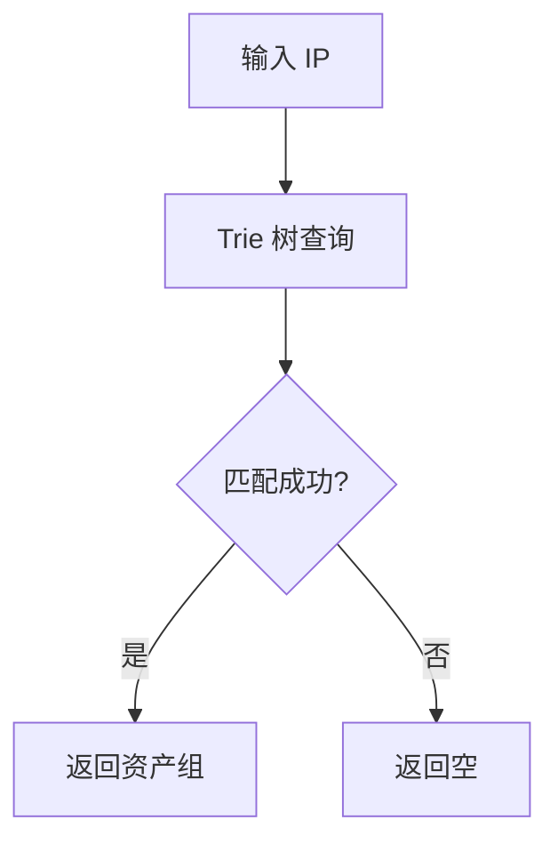

# 附录B：质量原则示例（原则 6-11）

**上级文档**：[01-documentation-standards.md](./01-documentation-standards.md)

本附录提供原则 6-11（质量原则）的详细示例、对比表格和模板。

**完整附录索引**：
- [01A-principles-0-5-examples.md](./01A-principles-0-5-examples.md) - 附录A：原则 0-5（职责、图表、同架、术语、数据、真实）
- **本文档** - 附录B：原则 6-11（实质、时效、关联、体系、溯源、决策）
- [01C-writing-standards-details.md](./01C-writing-standards-details.md) - 附录C：书写标准详细说明

---

## 原则 6：实质内容，拒绝形式主义

### 详细说明

文档必须干净利落，每一行都有实质内容，不能为了写文档而写文档。

### 形式主义内容清单

**必须删除的形式主义内容**：

| 类型 | 示例 | 删除原因 |
|------|------|---------|
| 文档元数据 | 维护人、更新频率、联系方式、文档版本 | 应在代码仓库元数据中维护，不是技术内容 |
| 阅读指南 | "本文档适合XX阅读"、"推荐阅读路径" | 文档本身应清晰，无需额外指南 |
| 统计数据 | 总文档数、总阅读时间、文档覆盖率 | 无实质帮助，形式主义 |
| 待办清单 | TODO、实施计划、变更日志 | 应在任务管理系统中维护 |
| 场景示例 | "典型案例"、"用户故事" | 技术文档不需要业务场景（除非方案必需） |
| FAQ/Q&A | "常见问题"、"为什么..."、"如何..." | 自问自答形式应改为直接陈述 |

### 删除测试法

对于每一段内容，问自己：

> **如果删除这段内容，技术方案是否仍然完整？**

- 如果**是**，说明该内容是冗余的，应该删除
- 如果**否**，说明该内容是核心的，应该保留

**示例**：

```markdown
## 文档信息（❌ 应删除）

- **维护人**：张三
- **最后更新**：2025-01-18
- **更新频率**：每周
- **适合人群**：后端开发工程师
- **推荐阅读时间**：30分钟

**删除测试**：删除后，技术方案仍然完整，说明这段内容是形式主义，应删除。
```

---

## 原则 7：时效准确，只记录最新状态

### 详细说明

文档只关注当前最新的情况，不出现历史演变描述。

### 历史信息的正确组织

**文档中不应出现的历史描述**：

❌ 错误示例：

```markdown
## 资产匹配算法演变

### 1.0 版本（2023-05）
最初使用线性遍历匹配，时间复杂度 O(n)。

### 2.0 版本（2024-03）
改用哈希表优化查询，时间复杂度降低到 O(1)。

### 3.0 版本（2025-01，当前版本）
引入 Trie 树优化 IP 范围匹配，支持快速前缀查询。
```

✅ 正确示例（主文档）：

```markdown
## 资产匹配算法

使用 Trie 树实现 IP 范围快速匹配：



**时间复杂度**：O(log n)，n 为 IP 范围数量

**代码位置**：`internal/belong/trie.go:45-78`

**历史设计演变**：详见 [ADR-003：选择Trie树优化IP匹配](./adr/003-choose-trie-tree.md)
```

✅ 正确示例（ADR 文档）：

`.specify/specs/{feature}/design/adr/003-choose-trie-tree.md`

```markdown
# ADR-003: 选择 Trie 树优化 IP 匹配

**状态**：已接受
**决策日期**：2025-01-15
**决策人**：张三

## 背景

2.0 版本使用哈希表匹配单个 IP，但无法高效处理 IP 范围匹配（如 `192.168.1.0/24`）。

## 决策

采用 Trie 树实现 IP 前缀匹配，时间复杂度从 O(n) 降低到 O(log n)。

## 历史方案对比

| 版本 | 数据结构 | 时间复杂度 | 支持IP范围 | 弃用原因 |
|------|---------|-----------|-----------|---------|
| 1.0 | 线性遍历 | O(n) | ✅ | 性能差 |
| 2.0 | 哈希表 | O(1) | ❌ | 不支持范围匹配 |
| **3.0** | **Trie 树** | **O(log n)** | **✅** | **当前方案** |

## 后果

- 优点：支持 IP 范围快速匹配
- 缺点：实现复杂度增加，内存占用增加约 20%
```

---

## 原则 8：关联准确，引用必须有效

### 详细说明

文档中所有的引用、链接、路径必须是存在的、准确的、有效的。

### 引用格式规范

| 引用类型 | 格式 | 示例 |
|---------|------|------|
| 文档引用（相对路径） | `[描述](相对路径)` | `详见 [架构设计](./01-architecture.md)` |
| 代码位置（当前分支） | `` `文件路径:行号` `` | `` `internal/belong/match.go:123-156` `` |
| 代码位置（其他分支） | `` `分支@文件路径:行号` `` | `` `master@internal/belong/match.go:123` `` |
| 代码位置（历史版本） | `` `commit@文件路径:行号` `` | `` `0d414bd@internal/belong/match.go:123` `` |
| 数据来源（附录） | `[来源描述](附录位置)` | `MongoDB统计（见附录A1）` |
| 外部链接（URL） | `[描述](完整URL)` | `[Grafana监控](http://grafana.example.com/dashboard/xxx)` |

### 引用验证清单

**在提交文档前，必须验证**：

- [ ] 所有 `[xxx](xxx.md)` 链接指向的文件都存在
- [ ] 所有 `` `file:line` `` 引用的代码位置都准确
- [ ] 所有数据来源都有明确的查询方法或文档位置
- [ ] 没有"某个文档"、"之前说过"这样的模糊引用
- [ ] 所有相对路径都使用 `./` 或 `../` 明确路径关系

**验证工具**：

```bash
# 验证文档链接有效性
grep -r '\[.*\](.*\.md)' . | while read line; do
  file=$(echo $line | sed 's/.*(\(.*\.md\)).*/\1/')
  [ -f "$file" ] || echo "❌ 无效链接: $file"
done

# 验证代码位置引用
grep -r '`[^`]*\.go:[0-9]' . | while read line; do
  file=$(echo $line | sed 's/.*`\([^:]*\):.*/\1/')
  [ -f "$file" ] || echo "❌ 无效代码位置: $file"
done
```

---

## 原则 9：体系组织，符合阅读心智

### 详细说明

文档必须被正确组织关联，有清晰的体系，符合人与AI的阅读心智历程。

### 编号体系规范

**完整编号规则**：

| 编号类型 | 格式 | 使用场景 | 示例 |
|---------|------|---------|------|
| 主文档 | `01-`, `02-`, `03-`, ... | 独立主题，按逻辑顺序编号 | `01-overview.md`, `02-architecture.md` |
| 附录文档 | `01A-`, `01B-`, `01C-`, ... | 主文档的补充细节，使用字母后缀 | `04A-detailed-examples.md`, `04B-performance-data.md` |
| 子主题 | `01.1-`, `01.2-`, `01.3-`, ... | 主题下的子主题（尽量少用，优先拆分） | `03.1-cache-strategy.md`, `03.2-cache-invalidation.md` |
| ADR | `001-`, `002-`, `003-`, ... | 架构决策记录，独立编号（3位数） | `adr/001-choose-mongodb.md` |
| Decision | `001-`, `002-`, `003-`, ... | 其他阶段决策记录，独立编号（3位数） | `decisions/001-rejected-approach.md` |

### 目录结构示例

**Feature 目录完整结构**：

```
.specify/specs/feature-refactor-belong/
├── README.md                           # 📌 目录索引（必须）
├── 01-analysis/                        # 分析阶段
│   ├── README.md
│   ├── 01-current-implementation.md    # 当前实现分析
│   ├── 02-performance-analysis.md      # 性能分析
│   ├── 02A-performance-data.md         # 附录：性能数据
│   └── decisions/                      # 分析阶段决策记录
│       ├── README.md
│       └── 001-rejected-nosql.md
├── 02-design/                          # 设计阶段
│   ├── README.md
│   ├── 01-architecture.md              # 架构设计
│   ├── 02-api-design.md                # API 设计
│   ├── 03-data-model.md                # 数据模型
│   ├── 03A-schema-examples.md          # 附录：Schema 示例
│   └── adr/                            # 架构决策记录（保持传统命名）
│       ├── README.md
│       ├── 001-choose-cache-pattern.md
│       └── 002-select-message-queue.md
├── spec.md                             # 需求规格（固定名称）
├── plan.md                             # 实施计划（固定名称）
└── tasks.md                            # 任务清单（固定名称）
```

### README.md 索引模板

**目录索引文件示例**：

```markdown
# Feature: 归属判定重构

本目录包含归属判定功能的重构文档。

## 📚 文档列表

### 分析阶段
1. [01-current-implementation.md](./01-analysis/01-current-implementation.md) - 当前实现分析
2. [02-performance-analysis.md](./01-analysis/02-performance-analysis.md) - 性能分析
   - [02A-performance-data.md](./01-analysis/02A-performance-data.md) - 附录：性能数据

### 设计阶段
1. [01-architecture.md](./02-design/01-architecture.md) - 架构设计
2. [02-api-design.md](./02-design/02-api-design.md) - API 设计
3. [03-data-model.md](./02-design/03-data-model.md) - 数据模型
   - [03A-schema-examples.md](./02-design/03A-schema-examples.md) - 附录：Schema 示例

### 决策记录
- [分析阶段决策](./01-analysis/decisions/)
- [架构决策记录 (ADR)](./02-design/adr/)
```

---

## 原则 10：代码溯源，明确基准

### 详细说明

所有剖析代码的文档必须明确标注代码仓库、分支、提交信息，防止多分支开发或 worktree 导致混乱。

### 代码基准标注格式

**最简格式**（至少包含）：

```markdown
**代码基准**：`sangfor.com/xdr/go-idt` @ `feature-1030039-refactor` (`0d414bd`, 2025-01-18)
```

**完整格式**（推荐）：

```markdown
## 代码基准信息

| 项目 | 信息 |
|------|------|
| 仓库路径 | `sangfor.com/xdr/go-idt` |
| 分析分支 | `feature-1030039-refactor` |
| 提交 Hash | `0d414bd` |
| 提交日期 | 2025-01-18 |
| 分析日期 | 2025-01-20 |
| Worktree 名称 | `refactor-belong` (如使用 worktree) |

**获取代码**：
```bash
git clone http://mirrors.sangfor.org/github/sangfor/xdr/go-idt.git
git checkout feature-1030039-refactor
git reset --hard 0d414bd
```
```

### 代码位置引用格式

**包含分支信息的引用**：

| 引用场景 | 格式 | 示例 | 说明 |
|---------|------|------|------|
| 当前分支代码 | `` `文件:行号` `` | `` `internal/belong/match.go:123-156` `` | 分析文档中的默认引用 |
| 其他分支代码 | `` `分支@文件:行号` `` | `` `master@internal/belong/match.go:123` `` | 对比其他分支实现 |
| 历史版本代码 | `` `commit@文件:行号` `` | `` `0d414bd@internal/belong/match.go:123` `` | 引用特定历史版本 |
| 其他仓库代码 | `` `仓库@文件:行号` `` | `` `go-sip@pkg/asset/query.go:45` `` | 跨仓库引用 |

### Worktree 场景标注

**使用 Git Worktree 时的标注**：

```markdown
## 代码基准信息

**Worktree 使用说明**：

本项目使用 Git Worktree 管理多个并行开发分支：

| Worktree 名称 | 分支名称 | 工作目录 | 用途 |
|--------------|---------|---------|------|
| `main-dev` | `master` | `/root/code/go/src/sangfor.com/xdr/go-idt` | 主开发分支 |
| `refactor-belong` | `feature-1030039-refactor` | `/root/code/go/src/sangfor.com/xdr/go-idt-worktree/refactor-belong` | 归属判定重构 |
| `optimize-cache` | `feature-1030040-cache` | `/root/code/go/src/sangfor.com/xdr/go-idt-worktree/optimize-cache` | 缓存优化 |

**本文档分析的 Worktree**：`refactor-belong` @ `feature-1030039-refactor` (`0d414bd`)

**获取 Worktree**：
```bash
cd /root/code/go/src/sangfor.com/xdr/go-idt
git worktree add ../go-idt-worktree/refactor-belong feature-1030039-refactor
cd ../go-idt-worktree/refactor-belong
git reset --hard 0d414bd
```
```

---

## 原则 11：决策留痕，避免重复试错

### 详细说明

在开发的任何阶段，一旦发现某个方向不可行，必须记录下来，避免 AI 或团队成员重复尝试错误路径。

### 决策记录目录结构

**不同阶段的决策记录位置**：

```
.specify/specs/feature-refactor-belong/
├── 01-analysis/
│   └── decisions/                      # 分析阶段决策记录
│       ├── README.md
│       ├── 001-rejected-redis-cache.md
│       └── 002-rejected-graphql-api.md
├── 02-spec/
│   └── decisions/                      # 规格阶段决策记录
│       ├── README.md
│       └── 001-deferred-multi-region.md
├── 03-design/
│   └── adr/                            # 架构决策记录（保持传统）
│       ├── README.md
│       ├── 001-choose-mongodb.md
│       └── 002-reject-elasticsearch.md
├── 04-plan/
│   └── decisions/                      # 计划阶段决策记录
│       ├── README.md
│       └── 001-rejected-big-bang-migration.md
└── 05-tasks/
    └── decisions/                      # 任务阶段决策记录
        ├── README.md
        └── 001-failed-goroutine-pool.md
```

### 决策记录模板

**通用 Decision Record 模板**：

```markdown
# Decision Record: {决策标题}

**编号**：DR-{阶段}-{序号}（如 DR-Analysis-001）
**状态**：已拒绝 / 已推迟 / 已失败
**决策日期**：2025-01-18
**决策者**：张三 / AI Session `sess-20250118-001`

## 背景

{为什么需要做这个决策？}

## 考虑的方案

{列出曾经考虑的方案，包括最终选择的和拒绝的}

## 决策

{决定拒绝/推迟/失败的方案是什么}

## 理由

{为什么拒绝这个方案？}

- 技术原因：{性能问题/复杂度过高/技术债务}
- 成本原因：{开发成本/维护成本/学习成本}
- 风险原因：{技术风险/业务风险/时间风险}

## 验证方法

{如何验证这个方案确实不可行？}

- [ ] 代码实现验证
- [ ] 性能测试验证
- [ ] 成本分析验证

## 后果

{拒绝这个方案的影响是什么？}

## 参考

- 相关代码：`internal/belong/match.go:123-156`
- 相关文档：[性能分析](../01-analysis/02-performance-analysis.md)
- 相关讨论：{会议纪要/邮件链接}
```

### ADR 模板（设计阶段）

**Architecture Decision Record 模板**：

```markdown
# ADR-{序号}: {决策标题}

**状态**：已接受 / 已拒绝 / 已替代 / 已弃用
**决策日期**：2025-01-18
**决策人**：张三

## 背景

{需要架构决策的背景和问题}

## 决策

{最终选择的架构方案}

## 原因

{为什么选择这个方案？}

## 替代方案

{考虑过但拒绝的方案，以及拒绝理由}

| 方案 | 优点 | 缺点 | 拒绝原因 |
|------|------|------|---------|
| 方案A | ... | ... | ... |
| 方案B | ... | ... | ... |

## 后果

{选择这个方案的影响}

- 优点：...
- 缺点：...
- 风险：...

## 验证

{如何验证这个决策是正确的？}
```

### decisions 目录 README.md 模板

```markdown
# 决策记录索引

本目录记录 {阶段名称} 阶段的决策，包括已拒绝的方案、已推迟的功能、失败的尝试。

## 📋 决策记录列表

| 编号 | 标题 | 状态 | 日期 | 决策者 |
|------|------|------|------|--------|
| 001 | [拒绝 Redis 缓存方案](./001-rejected-redis-cache.md) | 已拒绝 | 2025-01-15 | 张三 |
| 002 | [拒绝 GraphQL API](./002-rejected-graphql-api.md) | 已拒绝 | 2025-01-16 | AI Session sess-001 |
| 003 | [推迟多区域部署](./003-deferred-multi-region.md) | 已推迟 | 2025-01-17 | 李四 |

## 🎯 决策统计

- 总决策数：3
- 已拒绝：2
- 已推迟：1
- 已失败：0
```

---

**继续阅读**：[附录C：书写标准详细说明](./01C-writing-standards-details.md)
