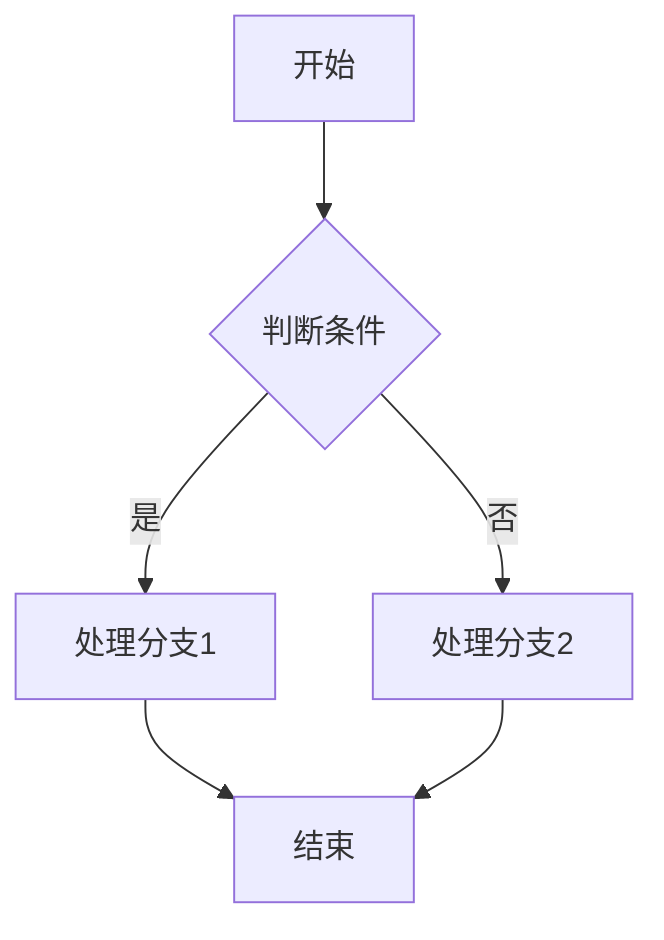
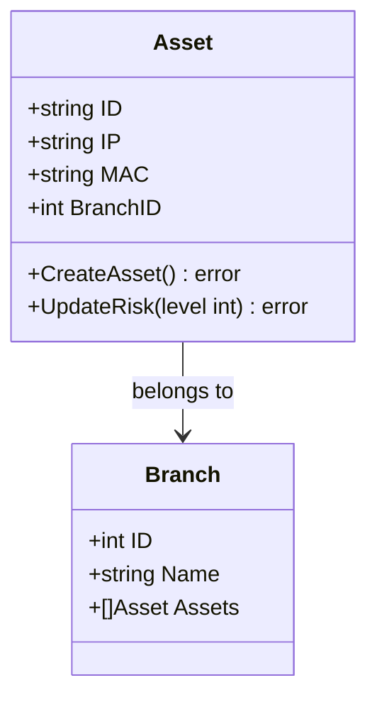
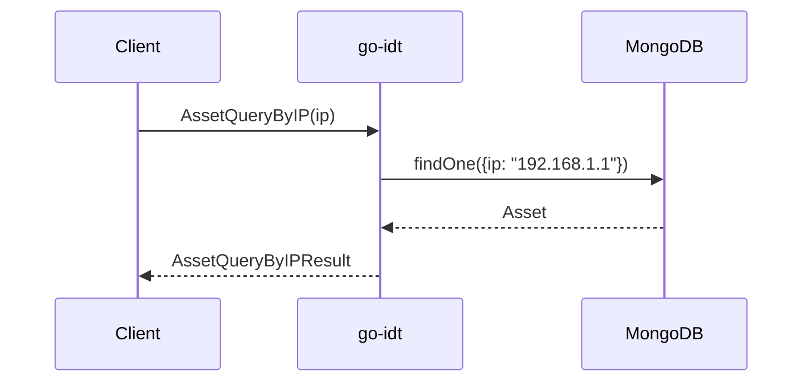
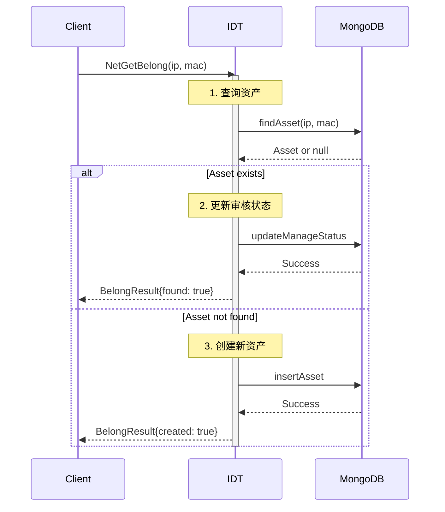
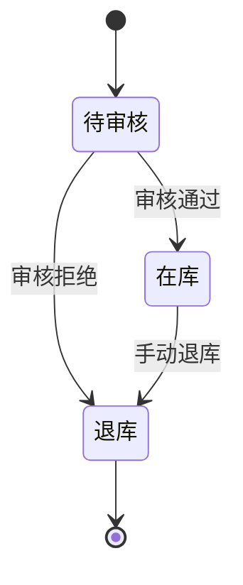
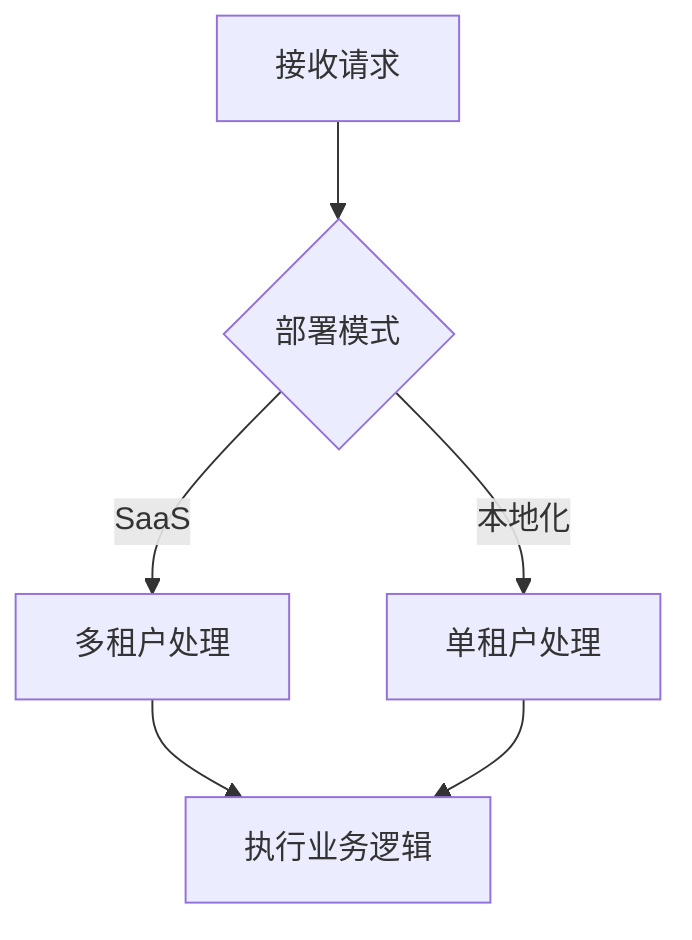

# 附录C：书写标准详细说明

**上级文档**：[01-documentation-standards.md](./01-documentation-standards.md)

本附录提供代码展示、图表绘制、环境适配等书写标准的详细说明。

**完整附录索引**：
- [01A-principles-0-5-examples.md](./01A-principles-0-5-examples.md) - 附录A：原则 0-5（职责、图表、同架、术语、数据、真实）
- [01B-principles-6-11-examples.md](./01B-principles-6-11-examples.md) - 附录B：原则 6-11（实质、时效、关联、体系、溯源、决策）
- **本文档** - 附录C：书写标准详细说明

---

## 1. 代码展示规范

### 1.1 代码块行数限制

**核心规则**：代码块不超过 **5 行**

**计算方式**：
- 注释行计入总行数
- 空行不计入总行数
- 函数签名和花括号计入总行数

**示例**：

✅ **5行代码块**（符合规范）：
```go
func createAsset(ip string) error {
    asset := &Asset{IP: ip}
    return db.Insert(asset)
}
```

❌ **6行代码块**（超过限制）：
```go
func createAsset(ip string) error {
    // 创建资产对象
    asset := &Asset{IP: ip}
    // 插入数据库
    return db.Insert(asset)
}
```

### 1.2 代码片段选择原则

**展示代码的目的**：
1. 说明关键接口签名
2. 展示核心数据结构字段
3. 说明关键算法步骤（但应优先用流程图）

**不应展示代码的场景**：
- 完整的函数实现 → 改用流程图 + 代码位置引用
- 完整的类定义 → 改用 Mermaid classDiagram
- 算法逻辑 → 改用 Mermaid flowchart
- 系统交互 → 改用 Mermaid sequenceDiagram

### 1.3 代码位置引用

**标准格式**：

| 场景 | 格式 | 示例 |
|------|------|------|
| 当前分支单个位置 | `` `文件:行号` `` | `` `internal/belong/match.go:123` `` |
| 当前分支行范围 | `` `文件:起始行-结束行` `` | `` `internal/belong/match.go:123-156` `` |
| 其他分支 | `` `分支@文件:行号` `` | `` `master@internal/belong/match.go:123` `` |
| 历史版本 | `` `commit@文件:行号` `` | `` `0d414bd@internal/belong/match.go:123` `` |
| 多个位置 | 列表格式 | 见下方示例 |

**多个代码位置示例**：

```markdown
**相关代码位置**：
- `internal/belong/match.go:123-156` - 资产匹配主逻辑
- `internal/belong/match.go:201-234` - IP范围匹配
- `internal/model/asset/create.go:45-67` - 资产创建
```

### 1.4 代码高亮语言标注

**必须标注语言类型**：

✅ 正确：
````markdown
```go
func example() {}
```
````

❌ 错误（无语言标注）：
````markdown
```
func example() {}
```
````

**常用语言标注**：
- Go: `go`
- Python: `python`
- JavaScript: `javascript` 或 `js`
- TypeScript: `typescript` 或 `ts`
- JSON: `json`
- YAML: `yaml`
- Bash: `bash`
- SQL: `sql`

---

## 2. Mermaid 图表规范

### 2.1 图表类型选择指南

**核心原则**：选择最适合表达意图的图表类型

| 内容类型 | 推荐图表 | 使用场景 |
|---------|---------|---------|
| 数据结构 / 类定义 | `classDiagram` | 展示类/结构体的字段和方法 |
| 算法流程 / 业务流程 | `flowchart` | 展示步骤、判断、循环 |
| 系统交互 / API调用 | `sequenceDiagram` | 展示组件间消息传递 |
| 状态机 / 状态转换 | `stateDiagram-v2` | 展示状态和转换条件 |
| 系统架构 / 模块关系 | `graph TD` 或 `graph LR` | 展示层次结构和依赖关系 |
| 实体关系 | `erDiagram` | 展示数据库表关系 |

### 2.2 flowchart（流程图）

**适用场景**：
- 算法执行流程
- 业务处理流程
- 决策树

**基本语法**：



**节点类型**：
- `A[矩形节点]` - 处理步骤
- `B{菱形节点}` - 判断条件
- `C([圆角矩形])` - 开始/结束
- `D[(数据库)]` - 数据库操作
- `E[[子流程]]` - 调用子流程

**连线类型**：
- `-->` - 实线箭头
- `-.->` - 虚线箭头
- `-->|标签|` - 带标签的箭头

**最佳实践**：
1. 使用 `TD`（自上而下）或 `LR`（从左到右）布局
2. 判断节点使用 `{菱形}` 形状
3. 判断分支必须标注条件（`是`/`否` 或具体条件）
4. 避免交叉连线（调整节点顺序）

### 2.3 classDiagram（类图）

**适用场景**：
- 数据结构定义
- 类/结构体字段说明
- 接口定义

**基本语法**：



**字段可见性**：
- `+` public（公开）
- `-` private（私有）
- `#` protected（保护）
- `~` package（包内）

**关系类型**：
- `-->` 关联
- `--o` 聚合
- `--*` 组合
- `--|>` 继承
- `..|>` 实现接口

**最佳实践**：
1. 仅展示关键字段，省略getter/setter
2. 方法签名包含参数和返回值
3. 关系连线必须标注含义
4. 避免超过 5 个类（过多则拆分多个图）

### 2.4 sequenceDiagram（时序图）

**适用场景**：
- gRPC/HTTP 调用流程
- 组件间交互
- 事件处理流程

**基本语法**：



**消息类型**：
- `->>` 实线箭头（同步调用）
- `-->>` 虚线箭头（返回）
- `--)` 异步消息
- `-x` 调用失败

**最佳实践**：
1. 参与者（participant）使用简短别名
2. 关键参数写在消息标签中
3. 展示关键路径，省略次要步骤
4. 使用 `Note` 说明关键逻辑

**复杂场景示例**：



### 2.5 stateDiagram（状态图）

**适用场景**：
- 资产审核状态转换
- 工作流状态机
- 生命周期管理

**基本语法**：



**最佳实践**：
1. 使用 `[*]` 表示开始和结束状态
2. 状态名称使用中文（清晰易懂）
3. 转换条件必须标注
4. 避免循环状态（除非业务需要）

### 2.6 图表通用规范

**命名规范**：
- 节点名称：简短、准确、见名知义
- 使用中文（技术文档面向团队）
- 避免缩写（除非是公认的行业术语）

**布局规范**：
- 流程图优先使用 `TD`（自上而下）
- 架构图优先使用 `LR`（从左到右）
- 避免交叉连线
- 保持图表简洁（单个图表不超过 15 个节点）

**标注规范**：
- 每个图表前必须有说明文字
- 复杂逻辑使用 `Note` 补充说明
- 关键节点使用颜色高亮（可选）

---

## 3. 环境适配规范

### 3.1 SaaS vs 本地化标注

**核心原则**：**默认共同，仅标注差异**

**标注方式**：

**方式 1：在流程图中标注差异分支**



**方式 2：使用环境差异表格**

```markdown
## 租户隔离策略

**环境差异**：

| 配置项 | SaaS | 本地化 | 说明 |
|--------|------|--------|------|
| 租户数量 | 多租户 | 单租户 | SaaS 支持多租户隔离 |
| 租户ID来源 | 请求头 `X-Tenant-ID` | 配置文件 `tenant.tenantId` | - |
| 数据库隔离 | 按租户ID分库/分表 | 单一数据库 | - |

**配置切换**：`config.yaml` 中 `deployMode: saas|local`
```

**方式 3：在文档开头集中说明**

```markdown
## 环境适配说明

**本文档描述的功能在 SaaS 和本地化环境中基本相同**，仅以下差异：

1. **租户隔离**（第 3.2 节）：SaaS 支持多租户，本地化为单租户
2. **消息队列**（第 4.1 节）：SaaS 使用云服务 Kafka，本地化使用内网 Kafka

**其他功能无差异**，代码使用同一架构，通过配置切换。
```

### 3.2 禁止的环境对比方式

**❌ 错误方式 1：全量平行对比**

```markdown
## SaaS 版本架构

1. API 网关
2. go-idt 服务
3. MongoDB 集群
4. Kafka 消息队列

## 本地化版本架构

1. API 网关（相同）
2. go-idt 服务（相同）
3. MongoDB 集群（相同）
4. Kafka 消息队列（部署位置不同）
```

**✅ 正确方式：仅标注差异**

```markdown
## 系统架构

系统由以下组件组成：
1. API 网关
2. go-idt 服务
3. MongoDB 集群
4. Kafka 消息队列

**环境差异**：
- **Kafka**：SaaS 使用云服务，本地化使用内网部署
```

### 3.3 配置开关说明

**在代码中体现配置开关**：

```go
// 配置结构
type Config struct {
    DeployMode   string `yaml:"deployMode"`   // "saas" 或 "local"
    TenantID     string `yaml:"tenantId"`     // 本地化环境的默认租户ID
}

// 租户ID获取逻辑
func (s *Service) getTenantID(ctx context.Context) string {
    if s.config.DeployMode == "saas" {
        // SaaS：从请求头提取
        return metadata.FromContext(ctx)["X-Tenant-ID"]
    } else {
        // 本地化：使用配置文件
        return s.config.TenantID
    }
}
```

**代码位置**：`internal/config/config.go:23-35`, `internal/idt/service.go:67-78`

**在文档中说明配置**：

```markdown
## 配置切换

**配置文件**：`config.yaml`

```yaml
# 部署模式：saas（SaaS版本） / local（本地化版本）
deployMode: saas

# 本地化环境的默认租户ID（仅 deployMode=local 时生效）
tenantId: "default-tenant"
```

**代码位置**：`internal/config/config.go:23-35`
```

---

## 4. 表格使用规范

### 4.1 表格列数限制

**核心规则**：表格列数 ≤ **5 列**

**原因**：超过 5 列在文档中难以阅读，应考虑拆分或改用其他展示方式

**处理方式**：

❌ **错误示例**（7列表格）：

| 接口名称 | QPS | P95延迟 | P99延迟 | CPU使用率 | 内存使用 | 错误率 |
|---------|-----|--------|--------|----------|---------|--------|
| AssetQueryByIP | 8000 | 85ms | 120ms | 45% | 2.1GB | 0.01% |

✅ **正确示例 1**（拆分为两个表格）：

**性能指标**：

| 接口名称 | QPS | P95延迟 | P99延迟 |
|---------|-----|--------|--------|
| AssetQueryByIP | 8000 | 85ms | 120ms |

**资源使用**：

| 接口名称 | CPU使用率 | 内存使用 | 错误率 |
|---------|----------|---------|--------|
| AssetQueryByIP | 45% | 2.1GB | 0.01% |

✅ **正确示例 2**（改用列表）：

**AssetQueryByIP 接口指标**：
- **QPS**：8000
- **P95 延迟**：85ms
- **P99 延迟**：120ms
- **CPU 使用率**：45%
- **内存使用**：2.1GB
- **错误率**：0.01%

### 4.2 表格对齐规范

**Markdown 表格对齐**：
- 文本内容：左对齐 `|---------|`
- 数字数据：右对齐 `|---------:|`
- 状态标识：居中对齐 `|:-------:|`

**示例**：

```markdown
| 接口名称 | QPS | 状态 |
|:--------|----:|:----:|
| AssetQueryByIP | 8000 | ✅ |
| EndGetBelong | 850 | ✅ |
```

### 4.3 表格内容规范

**单元格内容**：
- 保持简洁，避免长文本
- 使用缩写（但需要在表格前说明）
- 数字使用千分位分隔符（如 `1,250,000`）

**状态标识**：
- ✅ 正常/通过/是/启用
- ❌ 异常/失败/否/禁用
- ⚠️ 警告/待确认
- ❓ 未知/缺失
- 🚧 进行中/开发中

---

## 5. 章节组织规范

### 5.1 章节层级

**最大层级**：不超过 **4 级**（H1-H4）

**层级规范**：
- **H1 (`#`)**：文档标题（每个文档只有一个）
- **H2 (`##`)**：主要章节
- **H3 (`###`)**：子章节
- **H4 (`####`)**：细节说明

**❌ 避免使用 H5、H6**：
- 如果需要更深层级，说明文档结构过于复杂，需要拆分

### 5.2 章节命名

**命名原则**：
- 使用名词短语（如"资产匹配算法"）
- 避免动词开头（不要"如何匹配资产"）
- 简洁准确（≤ 15 字符）

**章节编号**：
- 主要章节使用数字编号（`## 1. 架构设计`）
- 子章节使用两级编号（`### 1.1 模块划分`）
- 附录章节不编号（`## 附录A：性能数据`）

### 5.3 单个章节长度

**建议长度**：单个章节不超过 **200 行**

**处理方式**：
- 如果章节过长，拆分为多个子章节
- 或将详细内容移到附录

---

## 6. 文档长度控制

### 6.1 总长度限制

**核心规则**：单个文档不超过 **800 行**

**行数统计**：
```bash
wc -l document.md
```

### 6.2 拆分策略

**当文档超过 800 行时，采用"主文档 + 附录"模式**：

**拆分原则**：
1. **主文档**：核心概念、关键流程、典型示例
2. **附录文档**：详细说明、完整示例、补充数据

**文件命名**：
- 主文档：`04-architecture-design.md`（保留原编号）
- 附录 A：`04A-detailed-examples.md`（使用字母后缀）
- 附录 B：`04B-performance-data.md`（依次递增）

**主文档引用附录**：

```markdown
## 3. 性能优化方案

**核心策略**：
1. 使用缓存减少数据库查询
2. 使用索引优化查询性能

**详细示例和性能数据**：参见 [附录A：性能优化详细示例](./04A-detailed-examples.md)
```

### 6.3 结构完整性

**拆分时必须保证**：
- 主文档结构完整，可独立阅读
- 附录是补充细节，不影响主文档理解
- 主文档和附录间有明确的引用关系

---

