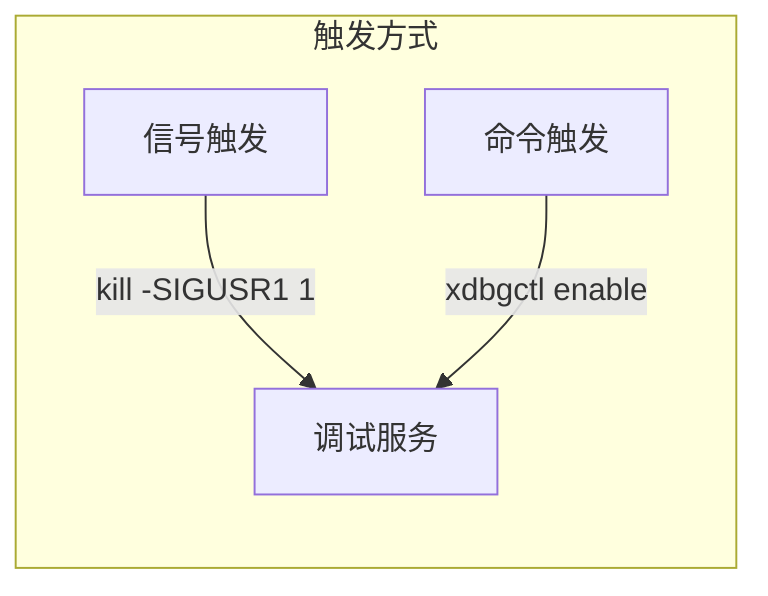
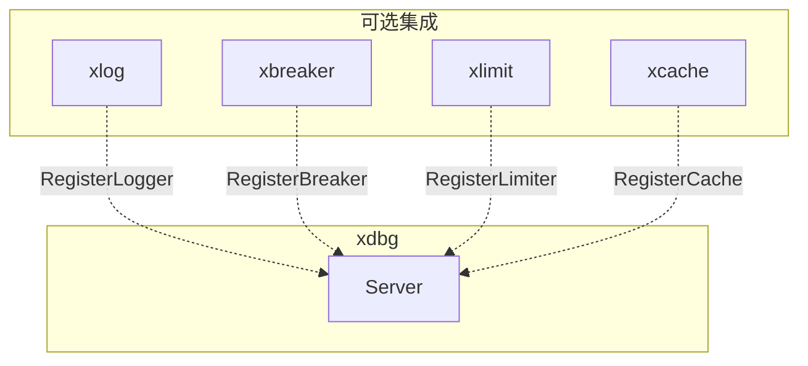
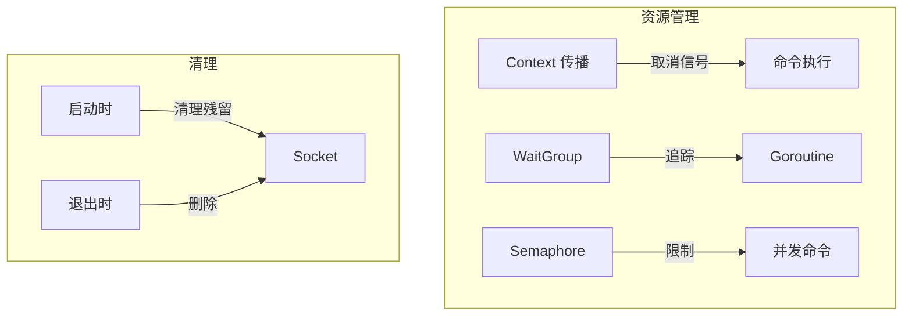

# xdbg 设计决策记录 (ADR)

## 元数据

| 字段 | 值 |
|------|-----|
| **Feature ID** | `feature-002-xdbg-runtime-debug` |
| **关联文档** | [spec.md](./spec.md), [plan.md](./plan.md) |
| **创建日期** | 2026-01-21 |
| **状态** | Draft |

---

## ADR-001: 仅使用 Unix Socket（不支持远程调试）

**状态**：已批准

**背景**：
K8s 环境中需要安全的调试通道。JumpServer 已控制谁能进入 Pod。

**决策**：
仅支持 Unix Socket，不提供 TCP/远程调试能力。

**理由**：
- **安全边界清晰**：JumpServer 控制入口 → 文件权限控制访问 → 审计记录操作
- **无需暴露网络端口**：天然防护外部攻击
- **文件权限（0600）**：提供访问控制
- **简化设计**：减少代码复杂度和攻击面
- **K8s 适用性**：Pod 内直接访问，无需 Service/Ingress

**不支持远程调试的理由**：
- 远程调试需要复杂的认证和加密
- JumpServer 已提供安全的远程访问通道
- 减少代码复杂度和潜在漏洞

**后果**：
- 正面：更安全、更简洁、更适合 K8s
- 负面：不支持跨主机调试（通过 JumpServer 进入 Pod 即可）

---

## ADR-002: 混合协议（二进制头 + JSON Payload）

**状态**：已批准

**背景**：
gobase 使用 Protobuf，需要决定协议方案。

**备选方案**：
1. Protobuf（gobase 方案）
2. 纯 JSON
3. 二进制头 + JSON Payload

**决策**：
使用二进制协议头 + JSON Payload 的混合协议。

**协议格式**：

```
+--------+--------+--------+--------+------------------+
| Magic  | Version| Type   | Length |   JSON Payload   |
| 2bytes | 1byte  | 1byte  | 4bytes |     N bytes      |
+--------+--------+--------+--------+------------------+

Magic:   0xDB 0x09 (固定标识)
Version: 0x01 (协议版本)
Type:    消息类型 (0x01=Request, 0x02=Response)
Length:  Payload 长度 (big-endian)
```

**理由**：
- **零编译依赖**：作为底层库，不应强制 protoc 工具链
- **调试友好**：JSON Payload 便于排查问题
- **效率足够**：调试场景不追求极致性能
- **简单实现**：无需代码生成

**后果**：
- 正面：零依赖，易调试，单二进制静态编译
- 负面：比 Protobuf 略大（可接受）

---

## ADR-003: 仅支持需要 exec 的触发方式

**状态**：已批准

**背景**：
K8s 环境中需要安全的调试触发方式。ConfigMap/环境变量等远程触发方式降低了安全门槛。

**决策**：
仅支持两种触发方式，都需要 exec 进入 Pod：



**理由**：
- **安全优先**：所有触发方式都需要通过 JumpServer + kubectl exec
- **信号触发**：最直接，兼容 gobase 用法
- **命令触发**：更直观，便于脚本化
- **无远程触发**：不支持 ConfigMap、环境变量等方式

**不支持 ConfigMap/环境变量触发的理由**：
- ConfigMap 触发允许通过 `kubectl patch` 远程触发，绕过 exec 权限控制
- 降低了安全门槛
- 生产环境应确保所有调试操作都需要进入 Pod

**后果**：
- 正面：安全性更高，设计更简洁
- 负面：不支持远程批量触发（可通过脚本 + kubectl exec 实现）

---

## ADR-004: xkit 模块集成采用可选注入

**状态**：已批准

**背景**：
xdbg 需要与 xbreaker/xlimit/xcache 集成，但不应强制依赖。

**决策**：
通过 `Register*` 方法可选注入，不引入硬依赖。



**理由**：
- **解耦**：xdbg 可独立使用基础功能
- **灵活**：用户按需注册
- **无循环依赖**：接口定义在 xdbg 内部

**后果**：
- 正面：松耦合，按需集成
- 负面：用户需要手动注册（可接受）

---

## ADR-005: 简洁安全模型（JumpServer + 文件权限 + 审计）

**状态**：已批准

**背景**：
gobase/mdbg 使用简单的 UID 检查（可伪造）。JumpServer 已控制谁能进入 Pod。

**决策**：
依赖 JumpServer + 文件权限 + 审计日志，不引入额外认证，不支持远程调试。

**安全链路**：


**理由**：
- **入口控制**：JumpServer 已完成身份认证和权限控制
- **访问控制**：Unix Socket 文件权限 0600，仅 owner 可访问
- **操作追溯**：SO_PEERCRED 获取调用者 UID/PID，记录审计日志
- **简洁设计**：无需管理 Token，降低使用复杂度和攻击面

**后果**：
- 正面：使用更简单，无需管理 Token，安全链路清晰
- 负面：不支持远程调试（通过 JumpServer 进入 Pod 即可）

---

## ADR-006: 协程安全与资源管理

**状态**：已批准

**背景**：
调试服务涉及长时间运行的命令（如 pprof cpu 30s）、网络连接、文件操作，必须防止资源泄露。

**决策**：
实施严格的资源生命周期管理。

**核心设计**：



1. **Context 传播**：所有命令接受 context，支持取消
2. **Goroutine 追踪**：WaitGroup + 超时保护
3. **并发限制**：信号量限制并发命令数（默认 5）
4. **文件清理**：启动/退出时清理 Socket 文件

**验证方式**：
- `go test -race` 检测数据竞争
- goleak 检测 goroutine 泄露
- FD 计数测试检测文件描述符泄露

**后果**：
- 正面：严格保证资源安全，生产环境可靠
- 负面：实现复杂度增加（可控）

---

## ADR-007: 客户端使用 urfave/cli/v3

**状态**：已批准

**背景**：
xdbgctl 客户端需要处理命令行参数、子命令、交互模式。

**备选方案**：
1. 标准库 `flag`
2. `spf13/cobra`
3. `urfave/cli/v3`

**决策**：
使用 `urfave/cli/v3@latest`。

**理由**：
- **轻量级**：比 cobra 更简洁
- **子命令支持**：天然支持 `xdbgctl enable/disable/setlog` 等子命令
- **交互模式友好**：易于实现 REPL
- **活跃维护**：v3 是最新版本

**后果**：
- 正面：更专业的 CLI 体验，代码更简洁
- 负面：引入一个外部依赖（可接受，仅客户端工具）

---

## ADR-008: 输出大小限制与 UTF-8 安全截断

**状态**：已批准

**背景**：
stack/breaker/cache 等命令可能产生大量输出，需要保护客户端稳定性。

**决策**：
- 默认 `maxOutputBytes = 1MB`
- 截断位置：命令执行后、JSON 编码前
- UTF-8 安全截断：不破坏多字节字符

**响应格式**：
```json
{
  "success": true,
  "output": "截断后的内容...",
  "truncated": true,
  "original_size": 2097152
}
```

**后果**：
- 正面：保护客户端，明确提示截断
- 负面：大输出需分页查看（可接受）

---

## ADR-009: xdbgctl 使用 urfave/cli/v3

**状态**：已实现

**背景**：
xdbgctl 客户端需要处理子命令、全局选项和交互模式。

**决策**：
xdbgctl 客户端使用 `urfave/cli/v3`（与 ADR-007 一致）。

**理由**：
- **子命令支持**：天然支持 `xdbgctl enable/disable/exec` 等子命令结构
- **交互模式友好**：便于实现 REPL
- **活跃维护**：v3 是最新版本，持续更新
- **轻量级**：比 cobra 更简洁

**后果**：
- 正面：更专业的 CLI 体验，代码更简洁
- 负面：引入一个外部依赖（可接受，仅客户端工具）

---

## ADR-010: Auto-shutdown 优雅关闭行为

**状态**：已实现

**背景**：
auto-shutdown 定时器触发时，可能有活跃会话正在执行命令。

**决策**：
Auto-shutdown 仅停止监听新连接，不主动终止现有会话。

**行为说明**：
1. 定时器触发时：调用 `stopListening()`
2. 现有会话：继续执行直到自然结束
3. 新连接：被拒绝

**理由**：
- **优雅关闭**：不中断正在执行的调试命令（如 pprof cpu 30s）
- **用户体验**：避免命令执行中途被强制断开
- **安全考虑**：允许正在进行的操作完成

**后果**：
- 正面：用户操作不会被意外中断
- 负面：完全关闭需要等待所有会话结束（符合预期）

---

## ADR-011: 必要命令保护机制

**状态**：已实现

**背景**：
命令白名单可能误配置，导致用户无法获取帮助或退出。

**决策**：
`help` 和 `exit` 命令始终允许执行，不受白名单限制。

**理由**：
- **用户体验**：即使配置了严格白名单，用户仍能获取帮助
- **安全退出**：始终可以安全关闭调试服务
- **防止锁定**：避免因配置错误导致服务不可用

**后果**：
- 正面：更健壮的用户体验
- 负面：无法完全禁用这两个命令（符合预期）

---

## ADR-012: Server 一次性使用设计

**状态**：已实现

**背景**：
Server 的 Start/Stop 状态转换设计需要明确。

**决策**：
Server 实例设计为一次性使用。Stop() 后不可再次 Start()。

**状态机**：
```
Created → Started → Listening → Stopped
              ↓           ↓
          Stopped ← ← ← ←
```

**理由**：
- **简化设计**：避免复杂的状态恢复逻辑
- **资源安全**：Stop 时清理所有资源，无需保留状态
- **典型用法**：应用启动时创建 Server，关闭时销毁

**使用模式**：
```go
// 正确用法
server, _ := xdbg.New()
server.Start(ctx)
// ... 使用 ...
server.Stop()

// 需要重启时，创建新实例
server2, _ := xdbg.New()
server2.Start(ctx)
```

**后果**：
- 正面：实现简单，资源管理清晰
- 负面：需要重新创建实例才能重启（可接受）

---

## ADR-013: BackgroundMode 使用场景

**状态**：已实现

**背景**：
BackgroundMode 禁用信号触发器，需要明确其使用场景。

**决策**：
BackgroundMode 用于程序化控制，不适用于 CLI 触发。

**使用场景**：
1. **集成测试**：测试中直接调用 Enable/Disable
2. **自定义触发**：应用自己实现触发逻辑（如 HTTP 端点）
3. **特殊环境**：不支持信号的环境

**限制**：
- BackgroundMode=true 时，`xdbgctl enable` 无法工作（因为它依赖信号）
- 需要程序内直接调用 `server.Enable()` 方法

**示例**：
```go
// 程序化控制
server, _ := xdbg.New(xdbg.WithBackgroundMode(true))
server.Start(ctx)
server.Enable()  // 程序内直接调用
// ... 调试 ...
server.Disable()
```

**后果**：
- 正面：支持程序化控制和测试场景
- 负面：不支持 CLI 触发（设计如此）

---

## 决策对比总结

| 决策项 | gobase/mdbg | xdbg |
|-------|-------------|------|
| 传输协议 | TCP + Protobuf | Unix Socket + 二进制头/JSON |
| 触发方式 | 仅 SIGUSR1 | 信号 + 命令（均需 exec） |
| 安全机制 | 简单 UID 检查 | 文件权限 + SO_PEERCRED 审计 |
| 模块集成 | 无 | xlog/xbreaker/xlimit/xcache |
| 资源管理 | 基本 | Context + WaitGroup + Semaphore |
| 客户端 CLI | 无/简单 | urfave/cli/v3 |
| 远程调试 | TCP 可选 | 不支持（安全优先） |

---

## 附录：实现验证说明

为避免 AI 工具误解代码实现，此处记录关键设计决策的实现验证：

### V-001: 自定义 Transport 生命周期管理

**实现位置**：`pkg/debug/xdbg/server.go:84-90`, `server_listen.go:76-80`

**实现细节**：
- `Server.customTransport` 布尔字段标记是否使用自定义 Transport
- `Start()` 时：如果 `opts.Transport != nil`，设置 `customTransport = true`
- `stopListening()` 时：仅当 `!customTransport` 时才重新创建 UnixTransport
- 自定义 Transport 由用户管理生命周期，Disable/Enable 不会替换

### V-002: CLI 快捷命令

**实现位置**：`cmd/xdbgctl/commands.go:27-56`

**实现细节**：
- `createShortcutCommand()` 创建直接子命令（setlog, stack, pprof 等）
- 用户可直接使用 `xdbgctl setlog debug`，等价于 `xdbgctl exec setlog debug`
- 快捷命令内部调用 `cmdExec()` 实现

### V-003: Socket 文件安全清理

**实现位置**：`pkg/debug/xdbg/transport_unix.go:46-58`

**实现细节**：
- `Listen()` 先用 `os.Stat()` 检查文件是否存在
- 检查 `info.Mode()&os.ModeSocket == 0`，如果不是 socket 返回错误
- 只有确认是 socket 文件时才执行 `os.Remove()`

### V-004: toggle 命令进程发现（原 enable 命令）

**实现位置**：`cmd/xdbgctl/commands.go:148-189`

**实现细节**：
- 优先级 1：使用用户指定的 `--pid` 参数
- 优先级 2：使用 `--name` 参数通过进程名查找（扫描 `/proc/*/comm`）
- 优先级 3：通过 socket 文件的 inode 在 `/proc` 中发现进程
- 如果发现失败，**返回错误**并提示用户指定 `--pid` 或 `--name`，不会自动回退到 PID 1
- 容器环境会给出特定提示

**注意**：此命令已从 `enable` 重命名为 `toggle`，详见 ADR-015。

### V-005: 输出截断与编码失败处理

**实现位置**：`pkg/debug/xdbg/protocol_codec.go:167-189`, `session.go:186-242`

**实现细节**：
- `TruncateOutput()` 在命令执行后、JSON 编码前截断
- `JSONOverhead = 200` 字节预留给 JSON 结构开销
- `validateOptions()` 校验 `MaxOutputSize <= MaxPayloadSize - JSONOverhead`
- 编码失败时：`sendEncodingErrorResponse()` 发送简化错误响应，不会崩溃

---

## ADR-014: PID 发现策略演进

**状态**：已实现

**背景**：
xdbgctl 客户端需要发现目标进程 PID 以发送 SIGUSR1 信号。原有设计通过 socket 文件发现进程，
但存在"鸡蛋问题"：socket 文件只有在调试服务 Enable 后才存在，而 Enable 需要先找到进程。

**决策**：
支持多种 PID 发现策略，优先级如下：
1. `--pid` 参数：用户明确指定的 PID
2. `--name` 参数：通过进程名在 `/proc/*/comm` 中查找
3. Socket 文件发现：通过 socket 文件 inode 在 `/proc` 中反向查找

**实现细节**：
- `findProcessByName()` 扫描 `/proc/*/comm` 匹配进程名
- 进程名匹配使用精确匹配（`comm` 文件内容 == 指定名称）
- Socket 发现失败时给出明确提示，而非自动回退到 PID 1

**使用示例**：
```bash
# 首次启用（socket 尚不存在）
xdbgctl toggle --name myapp
xdbgctl toggle --pid 1234

# 后续操作（socket 已存在）
xdbgctl toggle  # 自动通过 socket 发现
```

**后果**：
- 正面：解决了"鸡蛋问题"，提供更灵活的进程发现方式
- 负面：`--name` 仅支持 Linux（依赖 /proc 文件系统）

---

## ADR-015: 命令命名为 toggle（而非 enable）

**状态**：已实现

**背景**：
SIGUSR1 信号在 xdbg 中触发的是 `TriggerEventToggle` 事件，即切换调试服务状态。
`enable` 命令名称暗示的是单向"启用"操作，存在语义不匹配。

**决策**：
命令直接命名为 `toggle`，准确反映 SIGUSR1 的实际行为。

**理由**：
- **语义准确**：toggle 准确反映了 SIGUSR1 的实际行为（启用↔禁用切换）
- **避免误解**：用户不会误以为命令只能启用服务

**命令行为**：
```bash
$ xdbgctl toggle --name myapp
已向进程 1234 发送 SIGUSR1 信号（切换调试服务状态）
```

**后果**：
- 正面：命令语义准确，用户期望与实际行为一致

---

### V-006: toggle 命令进程发现优先级

**实现位置**：`cmd/xdbgctl/commands.go:148-185`

**实现细节**：
- `cmdToggle()` 按优先级依次尝试：`--pid` > `--name` > socket 发现
- `findProcessByName()` 扫描 `/proc/*/comm` 匹配进程名
