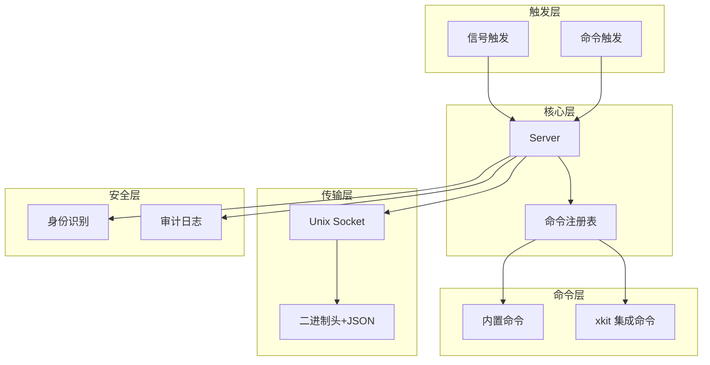
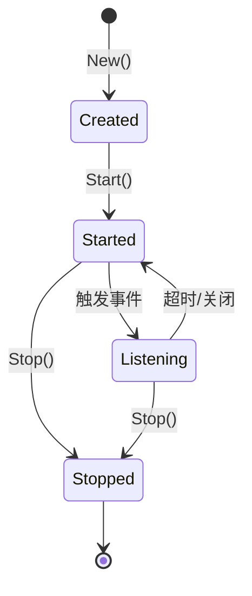
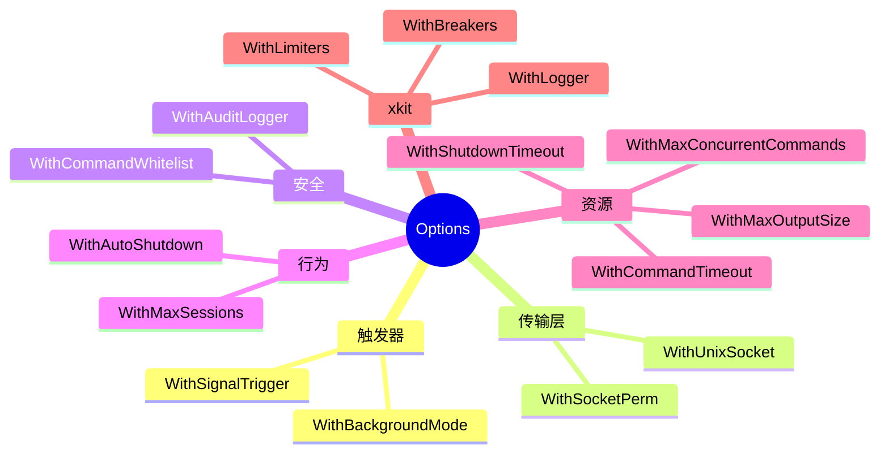
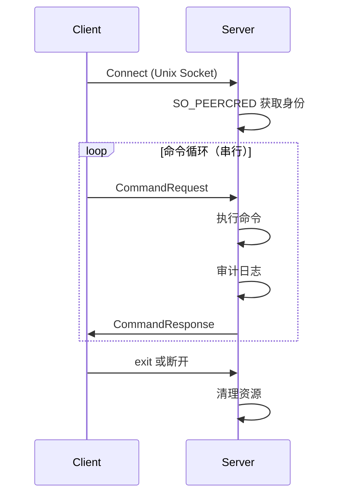
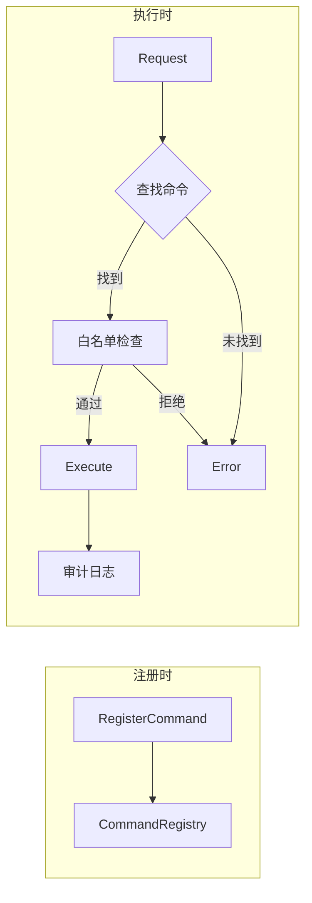
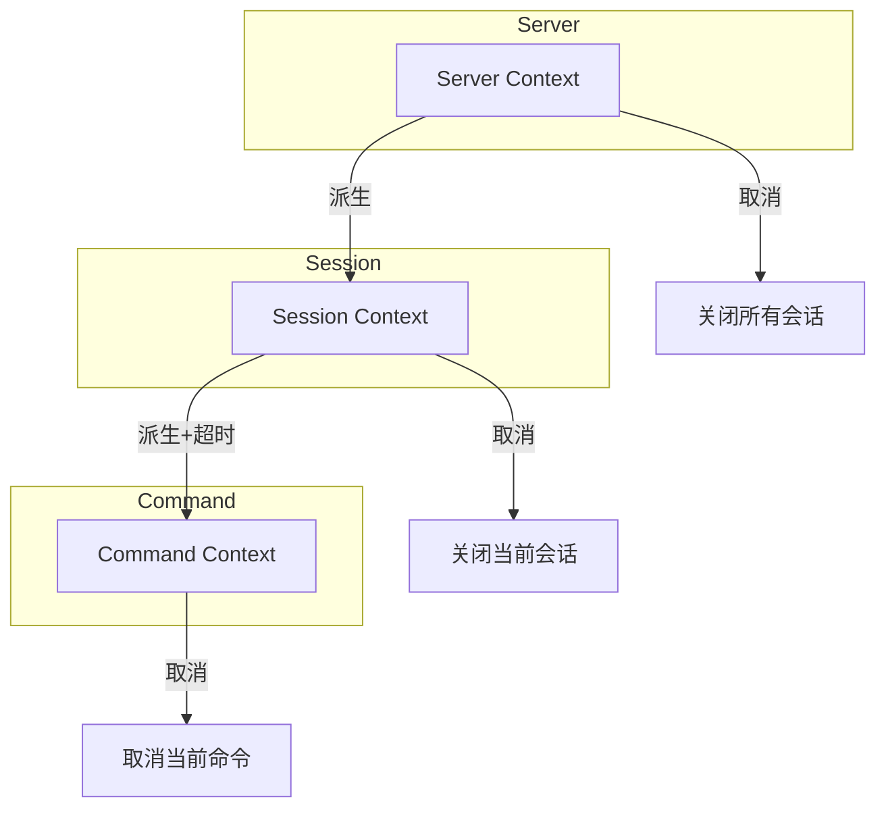
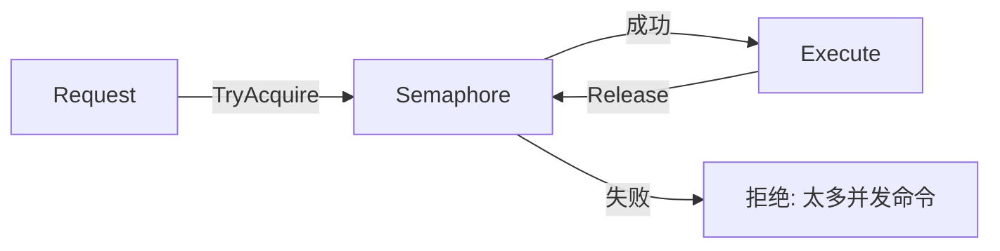
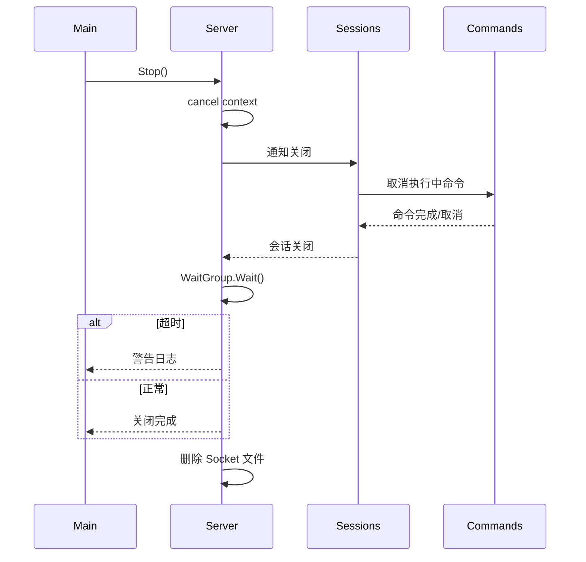

# xdbg 技术实现计划

## 元数据

| 字段 | 值 |
|------|-----|
| **Feature ID** | `feature-002-xdbg-runtime-debug` |
| **关联文档** | [spec.md](./spec.md), [decisions.md](./decisions.md) |
| **创建日期** | 2026-01-21 |
| **状态** | Draft |

---

## 1. 技术上下文

### 1.1 项目环境

| 项目 | 值 |
|------|-----|
| Go 版本 | 1.25+ |
| 服务端路径 | `pkg/debug/xdbg/` |
| 客户端路径 | `cmd/xdbgctl/` |
| 依赖模块 | xlog, xbreaker, xlimit, xcache |

### 1.2 依赖策略

| 组件 | 依赖 | 说明 |
|------|------|------|
| 服务端 | Go 标准库 + golang.org/x/sys | 使用 x/sys/unix 获取 SO_PEERCRED（官方扩展包） |
| 客户端 | urfave/cli/v3 | 专业 CLI 框架 |

### 1.3 标准库使用

```
os/signal       → 信号处理
net             → Unix Socket
encoding/binary → 二进制协议头
encoding/json   → JSON Payload
runtime         → Stack trace
runtime/pprof   → 性能分析
sync            → 并发控制
context         → 生命周期管理
```

---

## 2. 模块架构

### 2.1 整体架构



### 2.2 文件结构

```
pkg/debug/xdbg/
├── doc.go                    # 包文档
├── server.go                 # Server 核心
├── options.go                # Option 配置
├── errors.go                 # 错误定义
│
├── trigger.go                # Trigger 接口
├── trigger_signal.go         # 信号触发
├── trigger_signal_windows.go # Windows stub
│
├── transport.go              # Transport 接口
├── transport_unix.go         # Unix Socket
│
├── protocol.go               # 协议定义
├── protocol_codec.go         # 编解码器
│
├── command.go                # Command 接口
├── command_registry.go       # 命令注册表
├── command_builtin.go        # 内置命令
├── command_xkit.go           # xkit 集成命令
│
├── identity.go               # SO_PEERCRED
├── audit.go                  # 审计日志
│
└── *_test.go                 # 测试文件

cmd/xdbgctl/
├── main.go                   # 入口
├── client.go                 # 客户端
└── commands.go               # CLI 命令
```

---

## 3. 核心接口设计

### 3.1 Server 生命周期



### 3.2 接口定义

**Server**：调试服务器核心类型
- `New(opts ...Option) (*Server, error)` - 工厂方法
- `Start(ctx context.Context) error` - 启动服务
- `Stop() error` - 优雅关闭
- `RegisterCommand(cmd Command)` - 注册自定义命令

**Trigger**：触发器接口
- `Watch(ctx context.Context) <-chan TriggerEvent` - 监听事件
- `Close() error` - 关闭触发器

**Transport**：传输层接口
- `Listen(ctx context.Context) error` - 开始监听
- `Accept() (Conn, error)` - 接受连接
- `Close() error` - 关闭监听

**Command**：命令接口
- `Name() string` - 命令名
- `Help() string` - 帮助信息
- `Execute(ctx context.Context, args []string) (string, error)` - 执行

### 3.3 Option 配置



---

## 4. 协议设计

### 4.1 消息格式

```
+--------+--------+--------+--------+------------------+
| Magic  | Version| Type   | Length |   JSON Payload   |
| 2bytes | 1byte  | 1byte  | 4bytes |     N bytes      |
+--------+--------+--------+--------+------------------+

Magic:   0xDB 0x09
Version: 0x01
Type:    0x01=Request, 0x02=Response
Length:  Payload 长度 (big-endian)
```

### 4.2 消息类型

| Type | 名称 | 方向 | Payload |
|------|------|------|---------|
| 0x01 | CommandRequest | C→S | `{"command":"setlog","args":["debug"]}` |
| 0x02 | CommandResponse | S→C | `{"success":true,"output":"..."}` |

### 4.3 会话模型



---

## 5. 内置命令

### 5.1 基础命令

| 命令 | 说明 | 参数 |
|------|------|------|
| setlog | 修改日志级别 | `<level>` trace/debug/info/warn/error |
| pprof | 性能分析 | `cpu start/stop`, `heap`, `goroutine` |
| stack | goroutine 堆栈 | 无 |
| freemem | 释放内存 | 无 |
| help | 显示帮助 | 无 |
| exit | 关闭调试 | 无 |

### 5.2 xkit 集成命令

| 命令 | 说明 | 集成模块 |
|------|------|---------|
| breaker | 熔断器状态 | xbreaker |
| limit | 限流器状态 | xlimit |
| cache | 缓存统计 | xcache |
| config | 运行时配置 | xconf |

### 5.3 命令注册流程



---

## 6. 资源管理

### 6.1 Goroutine 生命周期



### 6.2 并发控制



| 限制项 | 默认值 | 说明 |
|--------|--------|------|
| maxSessions | 1 | 同时会话数 |
| maxConcurrentCommands | 5 | 全局并发命令数 |
| commandTimeout | 30s | 单命令超时 |
| shutdownTimeout | 10s | 优雅关闭超时 |

### 6.3 优雅关闭



---

## 7. 客户端设计

### 7.1 CLI 框架

使用 `urfave/cli/v3@latest`，支持：
- 子命令：`xdbgctl enable/disable/setlog/stack/...`
- 交互模式：REPL 风格
- 单命令模式：`xdbgctl setlog debug`

### 7.2 命令结构

```
xdbgctl
├── enable              # 启用调试服务
├── disable             # 禁用调试服务
├── setlog <level>      # 修改日志级别
├── stack               # 查看堆栈
├── pprof <action>      # 性能分析
├── breaker [name]      # 熔断器状态
├── limit [name]        # 限流器状态
├── cache [name]        # 缓存统计
├── help                # 帮助
└── interactive         # 交互模式
```

### 7.3 全局选项

| 选项 | 默认值 | 说明 |
|------|--------|------|
| `-s, --socket` | /var/run/xdbg.sock | Socket 路径 |
| `-t, --timeout` | 30s | 命令超时 |

---

## 8. 实现阶段

### Phase 1: 协议和基础

| 文件 | 内容 |
|------|------|
| errors.go | 错误定义 |
| protocol.go | 消息类型 |
| protocol_codec.go | 编解码器 |

### Phase 2: 触发器

| 文件 | 内容 |
|------|------|
| trigger.go | Trigger 接口 |
| trigger_signal.go | 信号触发（Unix） |
| trigger_signal_windows.go | Windows stub |

### Phase 3: 传输层

| 文件 | 内容 |
|------|------|
| transport.go | Transport 接口 |
| transport_unix.go | Unix Socket |

### Phase 4: 命令系统

| 文件 | 内容 |
|------|------|
| command.go | Command 接口 |
| command_registry.go | 注册表 |
| command_builtin.go | 内置命令 |
| command_xkit.go | xkit 集成 |

### Phase 5: 服务器核心

| 文件 | 内容 |
|------|------|
| options.go | Option 配置 |
| identity.go | SO_PEERCRED |
| audit.go | 审计日志 |
| server.go | 服务器实现 |

### Phase 6: 客户端

| 文件 | 内容 |
|------|------|
| cmd/xdbgctl/main.go | 入口 |
| cmd/xdbgctl/client.go | 客户端 |
| cmd/xdbgctl/commands.go | CLI 命令 |

### Phase 7: 文档和测试

| 文件 | 内容 |
|------|------|
| doc.go | 包文档 |
| example_test.go | 使用示例 |
| *_test.go | 单元测试 |
| benchmark_test.go | 基准测试 |

---

## 9. 测试策略

### 9.1 测试类型

| 类型 | 文件 | 覆盖内容 |
|------|------|---------|
| 单元测试 | protocol_test.go | 编解码 |
| 单元测试 | trigger_test.go | 触发器逻辑 |
| 单元测试 | transport_test.go | Socket 通信 |
| 单元测试 | command_test.go | 命令执行 |
| 单元测试 | server_test.go | 服务器生命周期 |
| 集成测试 | integration_test.go | 完整流程 |
| 基准测试 | benchmark_test.go | 性能验证 |
| 资源测试 | leak_test.go | goleak + FD |

### 9.2 Mock 策略

| 依赖 | Mock 方式 |
|------|----------|
| xlog.Leveler | 简单 Mock 结构体 |
| xbreaker.Breaker | 简单 Mock 结构体 |
| 网络 | net.Pipe() |
| 文件系统 | t.TempDir() |

### 9.3 质量门禁

| 检查项 | 目标 |
|--------|------|
| 测试覆盖率（核心） | ≥ 95% |
| 测试覆盖率（整体） | ≥ 90% |
| golangci-lint | 零警告 |
| go test -race | 无竞争 |
| goleak | 零泄露 |

---

## 10. 验收清单

### 10.1 功能验收

- [ ] 信号触发正常（开关模式）
- [ ] 命令触发正常（enable/disable）
- [ ] Unix Socket 通信正常
- [ ] 自动关闭正常
- [ ] 所有内置命令正常
- [ ] xkit 集成命令正常
- [ ] xdbgctl 客户端正常

### 10.2 质量验收

- [ ] 测试覆盖率达标
- [ ] golangci-lint 零错误
- [ ] race detector 通过
- [ ] 未激活时内存 < 1MB

### 10.3 资源安全验收

- [ ] goleak 测试通过
- [ ] FD 计数测试通过
- [ ] 优雅关闭测试通过
- [ ] Context 取消传播正确
- [ ] Socket 文件正确清理

### 10.4 文档验收

- [ ] doc.go 完整
- [ ] example_test.go 完整
- [ ] 中文注释完整

---

## 11. 风险缓解

| 风险 | 缓解措施 | 验证 |
|------|---------|------|
| 未授权访问 | 文件权限 0600 + 必须 exec | 安全测试 |
| 命令影响生产 | 白名单 + 只读为主 | 代码审查 |
| Socket 残留 | 启动清理 + 退出删除 | 集成测试 |
| Goroutine 泄露 | Context + WaitGroup | goleak |
| FD 泄露 | defer Close | FD 计数 |
| 长命令阻塞 | 超时 + Context | 超时测试 |

---

## 12. 相关文档

| 文档 | 路径 |
|------|------|
| 需求规格 | [spec.md](./spec.md) |
| 设计决策 | [decisions.md](./decisions.md) |
| 项目宪法 | `.specify/memory/constitution.md` |
| xlog 模块 | `pkg/observability/xlog/` |
| xbreaker 模块 | `pkg/resilience/xbreaker/` |
