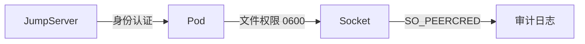
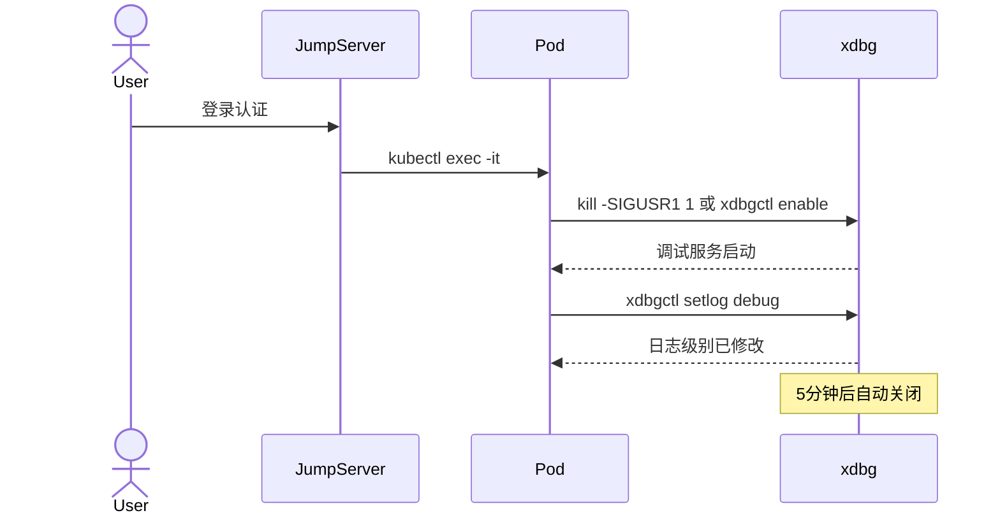

# Feature: xdbg 运行时调试模块

## 元数据

| 字段 | 值 |
|------|-----|
| **Feature ID** | `feature-002-xdbg-runtime-debug` |
| **创建日期** | 2026-01-21 |
| **状态** | Draft |
| **负责人** | TBD |
| **关联文档** | [decisions.md](./decisions.md), [plan.md](./plan.md) |

---

## 1. 需求背景

### 1.1 业务背景

XKit 作为企业级 Go 基础工具库，服务于 Kubernetes 部署场景。生产环境中，运维人员经常需要在不重启服务的情况下进行调试操作，如：修改日志级别、查看 goroutine 堆栈、分析内存使用、查看熔断器状态等。

### 1.2 需求来源

| 来源类型 | 描述 |
|---------|------|
| 运维需求 | 生产环境调试，无需重启服务 |
| 安全需求 | 调试功能按需开启，操作可审计 |
| 架构需求 | 与 xlog/xbreaker/xlimit 等模块联动 |
| K8s 需求 | 适配容器环境，支持多种触发方式 |

### 1.3 核心痛点

1. **调试入口缺失**：生产环境无法动态修改日志级别、查看内部状态
2. **K8s 环境限制**：传统 HTTP 调试端口在容器环境暴露困难
3. **安全性担忧**：调试功能常开存在安全风险
4. **孤立的调试**：调试操作与可观测性系统脱节

---

## 2. 差异化与创新点

### 2.1 业界方案对比

| 对比项 | gobase/mdbg | net/http/pprof | xdbg (本方案) |
|-------|-------------|----------------|---------------|
| **触发方式** | 仅信号 | 常开 HTTP | 信号 + 命令 |
| **K8s 友好** | 需 exec | 需暴露端口 | 原生支持 |
| **安全性** | 简单分级 | 无认证 | 文件权限 + 审计 |
| **模块集成** | 无 | 仅 pprof | xkit 全模块 |
| **协议** | TCP + Protobuf | HTTP | Unix Socket + JSON |
| **自动关闭** | 5分钟固定 | 无 | 可配置 |

### 2.2 独特价值

1. **安全优先设计**：必须 exec 进入 Pod 后才能触发调试
2. **Unix Socket Only**：无网络暴露，文件权限控制
3. **xkit 深度集成**：一键查看 xbreaker/xlimit/xcache/xconf 状态
4. **轻量级设计**：不引入 HTTP 框架，最小化依赖
5. **可观测性联动**：调试操作通过审计日志提供完整追溯（指标/追踪 hooks 作为 P2 可选功能）

---

## 3. User Stories

### US-1: 动态修改日志级别

**用户角色**：SRE 工程师

**业务需求**：作为 SRE，我需要在生产环境临时开启 Debug 日志排查问题，排查完成后恢复 Info 级别

**验收条件**：
- [ ] 支持通过 kubectl exec 发送信号开启调试
- [ ] 可修改日志级别为 trace/debug/info/warn/error
- [ ] 修改立即生效，无需重启
- [ ] 与 xlog.Leveler 接口集成

### US-2: 生产环境性能分析

**用户角色**：后端开发工程师

**业务需求**：作为开发人员，我需要在生产环境采集 CPU/Memory profile 分析性能问题

**验收条件**：
- [ ] 支持 CPU profile 采集（开始/停止/保存）
- [ ] 支持 Heap profile dump
- [ ] 支持 Goroutine 堆栈打印
- [ ] 支持释放内存到 OS

### US-3: 查看弹性组件状态

**用户角色**：平台运维工程师

**业务需求**：作为运维人员，我需要查看熔断器、限流器的实时状态，判断服务健康度

**验收条件**：
- [ ] 可查看 xbreaker 熔断器状态（Closed/Open/HalfOpen）
- [ ] 可查看 xlimit 限流器配额使用情况
- [ ] 可手动重置熔断器状态
- [ ] 状态信息包含统计数据

### US-4: 安全的调试访问

**用户角色**：安全工程师

**业务需求**：作为安全人员，我需要确保调试功能不会成为安全漏洞

**安全模型**：



**验收条件**：
- [ ] 调试功能默认关闭，需显式触发
- [ ] 触发后自动关闭（可配置超时，默认 5 分钟）
- [ ] 仅支持 Unix Socket（不暴露网络端口）
- [ ] Unix Socket 文件权限 0600
- [ ] 支持通过 SO_PEERCRED 获取调用者身份
- [ ] 所有调试操作记录审计日志

### US-5: K8s 环境调试

**用户角色**：K8s 运维工程师

**业务需求**：作为 K8s 运维，我需要安全的调试触发方式

**工作流程**：



**触发方式**：

| 触发方式 | 所需权限 | 说明 |
|---------|---------|------|
| 信号触发 | kubectl exec | `kill -SIGUSR1 1` |
| 命令触发 | kubectl exec | `xdbgctl enable` |

**验收条件**：
- [ ] 支持信号触发（SIGUSR1）
- [ ] 支持客户端命令触发（xdbgctl enable/disable）
- [ ] 客户端工具可通过 kubectl cp 复制进 Pod

---

## 4. 功能需求

### 4.1 触发机制

| ID | 需求 | 优先级 | 验收标准 |
|----|------|--------|---------|
| FR-1 | 信号触发（SIGUSR1） | P0 | 接收信号后开启/关闭（开关模式） |
| FR-2 | 命令触发（xdbgctl enable/disable） | P0 | 客户端命令控制服务启停 |
| FR-3 | 自动关闭 | P0 | 可配置超时，默认 5 分钟 |
| FR-4 | 手动关闭 | P0 | exit 命令或再次信号 |

### 4.2 通信协议

| ID | 需求 | 优先级 | 验收标准 |
|----|------|--------|---------|
| FR-5 | 仅支持 Unix Socket | P0 | 默认 /var/run/xdbg.sock |
| FR-6 | 混合协议 | P0 | 二进制头 + JSON Payload |
| FR-7 | 请求-响应模式 | P0 | 同步命令执行 |

### 4.3 内置命令（基础）

| ID | 命令 | 优先级 | 说明 |
|----|------|--------|------|
| FR-10 | setlog | P0 | 修改日志级别，集成 xlog.Leveler |
| FR-11 | pprof | P0 | CPU/Heap profile |
| FR-12 | stack | P0 | 打印 goroutine 堆栈 |
| FR-13 | freemem | P1 | 释放内存到 OS |
| FR-14 | help | P0 | 显示帮助 |
| FR-15 | exit | P0 | 关闭调试服务（不影响主应用） |

### 4.4 内置命令（xkit 集成）

| ID | 命令 | 优先级 | 说明 |
|----|------|--------|------|
| FR-16 | breaker | P1 | 查看熔断器状态，集成 xbreaker |
| FR-17 | limit | P1 | 查看限流器状态，集成 xlimit |
| FR-18 | cache | P2 | 查看缓存统计，集成 xcache |
| FR-19 | config | P2 | 查看运行时配置，集成 xconf |

### 4.5 安全机制

| ID | 需求 | 优先级 | 验收标准 |
|----|------|--------|---------|
| FR-20 | Unix Socket 权限控制 | P0 | 默认 0600 权限 |
| FR-21 | 调用者身份识别 | P0 | SO_PEERCRED 获取 UID/PID |
| FR-22 | 审计日志 | P0 | 记录所有操作及调用者身份 |
| FR-23 | 命令白名单 | P1 | 可选，限制可执行命令 |
| FR-24 | 并发限制 | P1 | 默认只允许 1 个会话 |

### 4.6 资源安全

| ID | 需求 | 优先级 | 验收标准 |
|----|------|--------|---------|
| FR-25 | Goroutine 生命周期管理 | P0 | 所有命令接受 context |
| FR-26 | 连接资源管理 | P0 | 客户端断开后自动清理 |
| FR-27 | 优雅关闭 | P0 | Stop() 等待所有 goroutine 完成 |
| FR-28 | 并发任务限制 | P0 | 限制同时执行的命令数（默认 5） |
| FR-29 | Socket 文件清理 | P0 | 启动时清理残留，退出时删除 |
| FR-30 | 输出大小限制 | P0 | 默认 1MB，超限截断 |

### 4.7 客户端工具

| ID | 需求 | 优先级 | 验收标准 |
|----|------|--------|---------|
| FR-31 | CLI 客户端 | P0 | xdbgctl 命令 |
| FR-32 | 交互模式 | P1 | REPL 风格 |
| FR-33 | 单命令模式 | P0 | xdbgctl setlog debug |
| FR-34 | 单二进制 | P0 | 静态编译，无依赖 |

---

## 5. 非功能需求

| ID | 需求 | 优先级 | 验收标准 |
|----|------|--------|---------|
| NFR-1 | 线程安全 | P0 | race detector 通过 |
| NFR-2 | 优雅关闭 | P0 | 带超时保护 |
| NFR-3 | 最小内存占用 | P0 | 未激活时 < 1MB |
| NFR-4 | 无外部依赖（服务端） | P0 | 不引入 HTTP/Protobuf |
| NFR-5 | 完整文档和示例 | P0 | doc.go + example_test.go |
| NFR-6 | Goroutine 零泄露 | P0 | goleak 测试通过 |
| NFR-7 | Context 传播 | P0 | 支持取消 |
| NFR-8 | 文件描述符安全 | P0 | FD 泄露测试通过 |

---

## 6. 验收标准（SMART）

### 6.1 功能指标

| 指标 | 目标值 | 验证方法 |
|------|--------|---------|
| 触发方式 | 2 种（信号 + 命令） | 功能测试 |
| 通信协议 | Unix Socket | 单元测试 |
| 内置命令 | ≥10 个 | 功能验证 |
| 自动关闭 | 可配置，默认 5 分钟 | 定时器测试 |
| xkit 集成 | xlog/xbreaker/xlimit/xcache | 集成测试 |

### 6.2 非功能指标

| 指标 | 目标值 | 验证方法 |
|------|--------|---------|
| 启动延迟 | < 100ms | 基准测试 |
| 内存占用 | < 1MB（未激活时） | 内存分析 |
| 命令响应延迟 | P99 < 50ms | 基准测试 |
| 代码覆盖率 | 核心 ≥95%，整体 ≥90% | go test -cover |
| 并发安全 | race detector 通过 | go test -race |
| Goroutine 泄露 | 零泄露 | goleak 测试 |

---

## 7. 风险与假设

### 7.1 风险

| ID | 风险 | 影响 | 概率 | 缓解措施 |
|----|------|------|------|---------|
| R1 | 调试端口被恶意利用 | 高 | 低 | 文件权限 0600 + 自动关闭 |
| R2 | 调试命令影响生产稳定性 | 高 | 中 | 命令白名单 + 只读命令为主 |
| R3 | 信号被其他组件占用 | 中 | 低 | 支持多种触发方式 |
| R4 | Unix Socket 文件残留 | 低 | 中 | 启动时清理 + 退出时删除 |

### 7.2 假设

| ID | 假设 | 验证方法 |
|----|------|---------|
| A1 | K8s Pod 支持发送信号 | K8s 文档 |
| A2 | Unix Socket 在容器内可用 | 功能测试 |
| A3 | xlog 实现 Leveler 接口 | 代码检查 |

### 7.3 约束

| ID | 约束 | 说明 |
|----|------|------|
| C1 | Go 1.25+ | 项目最低版本要求 |
| C2 | 服务端不引入 HTTP 框架 | 底层库不应有重依赖 |
| C3 | 不使用 Protobuf | 避免编译依赖 |
| C4 | 遵循 XKit API 风格 | Options 模式 |

---

## 8. 安全考虑

| 风险 | 缓解措施 |
|------|---------|
| 未授权访问 | JumpServer 入口控制 + 文件权限 0600 |
| 命令注入 | 命令白名单 + 参数校验 |
| 敏感信息泄露 | 审计日志脱敏 + 限制输出 |
| 拒绝服务 | 单会话限制 + 自动关闭 + 并发限流 |
| Goroutine 泄露 | Context 传播 + goleak 测试 |

---

## 9. 里程碑

| 阶段 | 交付物 | 状态 |
|------|--------|------|
| Phase 1 | spec.md 需求规格 | ✅ 完成 |
| Phase 2 | decisions.md 设计决策 | ✅ 完成 |
| Phase 3 | plan.md 技术计划 | 进行中 |
| Phase 4 | tasks.md 任务拆解 | 待开始 |
| Phase 5 | 代码实现 + 测试 | 待开始 |
| Phase 6 | 文档和示例 | 待开始 |
| Phase 7 | Code Review + 合并 | 待开始 |

---

## 附录 A: K8s 使用场景

```bash
# 完整调试流程

# 1. 通过 JumpServer 进入 Pod
kubectl exec -it pod/app -- /bin/sh

# 2. 触发调试（二选一）
kill -SIGUSR1 1                    # 方式1: 信号触发
xdbgctl enable                     # 方式2: 命令触发

# 3. 执行调试命令
xdbgctl setlog debug               # 修改日志级别
xdbgctl stack                      # 查看 goroutine 堆栈
xdbgctl breaker                    # 查看熔断器状态
xdbgctl pprof heap                 # dump 堆内存

# 4. 关闭调试（可选，会自动超时关闭）
xdbgctl disable
```

---

## 附录 B: 与 gobase/mdbg 对比

| 特性 | gobase/mdbg | xdbg |
|------|-------------|------|
| 触发方式 | 仅 SIGUSR1 | 信号 + 命令 |
| 传输协议 | TCP + Protobuf | Unix Socket + JSON |
| 安全机制 | 简单 UID 检查 | 文件权限 + SO_PEERCRED |
| 模块集成 | 无 | xlog/xbreaker/xlimit/xcache |
| 客户端 CLI | 无/简单 | urfave/cli/v3 |
